# 1차시. 객체지향 핵심 개념

1.  객체지향 개요

    1) 객체지향의 개념

    ##### OOP(Object Oriented Programming)

    

    -   하드웨어 : 시스템을 구성하는 각각의 기능들이 독립적인 모듈로 개발되어 특정 모듈이 고장 나거나 성능이 ㄸ러어지면 다른 모듈로 교체해 수정할 수 있음
    -   소프트웨어 : 모듈화가 되지 않은 상태로 개발되어 한번 작성된 코드는 재사용하지 어려움 => 모듈화된 소프트웨어 개발에 대한 요구 발생 => **객체지향 패러다임**

    

    -   절차지향 : 실행되는 순서가 위에서부터 아래로 순차적으로 진행되는 형태를 가진 언어

        -   프로그램 재사용 시 기존에 만들어진 코드를 복사하여 붙여넣기 하는 방법 사용

        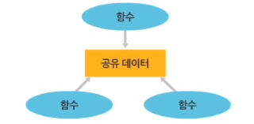

        -   자주 사용되는 특정한 코드를 하나의 모듈(묶음)로 묶어 놓은 것
        -   프로그래머가 사용하고 싶을 때마다 호출하여 코드가 실행되게 함

        -   데이터와 함수 간에 유기적인 관계성을 갖지 못함

    -   객체지향

        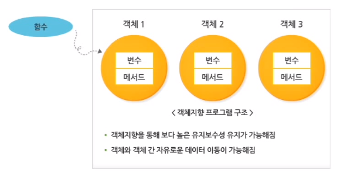

2) 객체, 클래스, 인스턴스

##### 객체(Object)

-   현실 세계에 존재하는 유/무형의 모든 것
-   정적인 요소 - 변수(Variable), 동적인 요소 - 메서드(Method)

##### 클래스(Class)

-   현실 세계의 객체를 프로그램에서 이용할 수 있는 객체로 만들기 위해 필요한 개념
-   클래스의 이름을 객체의 이름과 동일하게 작성
-   변수(variable)와 메서드(method)로 작성
-   클래스는 현실 세계의 객체를 컴퓨터 메모리에 생성할 수 있는 템플릿

##### 인스턴스(Instance)

-   인스턴스는 컴퓨터 메모리에 존재하는 객체

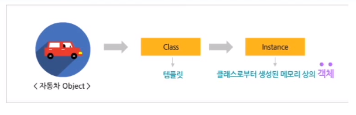

-   object = instance

<자동차 객체에  대한 Car 클래스>

```java
public class Car {
    // 객체의 속성을 나타내는 멤버 변수 선언
    String name;
    int currentSpeed;
    int currentGear;
    
    // 변수를 이용하여 구체적인 행위를 제공하는 메서드 선언
    void startEngine() {
        System.out.println("-> " + name + "의 시동을 켠다.");
        currentSpeed = 1;
    }
    
    void changeGear(int gear) {
        System.out.println("-> 기어를 " + gear + "단으로 변경한다.");
        currentGear = gear;
    }
    
    int getCurrentSpeed() {
        currentSpeed = currentSpeed + (currentGear * 10);
        return currentSpeed;
    }
    
    void stopEngine() {
        System.out.println("-> " + name + "의 시동을 끈다.");
        currentSpeed = 0;
        currentGear = 0;
    }
    
    String getCurrentState() {
        return name + "의 현재 속도 : " + getCurrentSpeed();
    }
}
```

<Car 클래스로부터의 인스턴스 생성>

```java
public class CarTest {
    public static void main(String[] args) {
        // Car 객체(Instance) 생성
        Car myCar = new Car();
        
        // 초기 값 설정
        myCar.name = "Red";
        myCar.currentGear = 0;
        myCar.currentSpeed = 0;
        
        // 메서드 호출
        myCar.startEngine();
        System.out.println(myCar.getCurrentState());
        myCar.changeGear(2);
        System.out.println(myCar.getCurrentState());
        myCar.changeGear(3);
        System.out.println(myCar.getCurrentState());
        myCar.stopEngine();
        System.out.println(myCar.getCurrentState());
    }
}
```

2.  객체지향 언어의 주요 개념

    1) 상속과 다형성

    ##### 상속(Inheritance)

    -   속성과 메서드가 약간 다른 객체를 필요로 한다면? 기존의 클래스를 이용해서 새로운 클래스를 작성함

    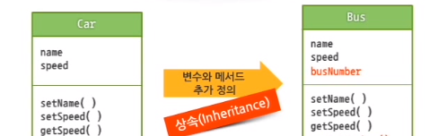

    ##### 상속의 특징

    -   상속은 코드를 간결하게 하여 코드의 재사용성을 높이는 객체지향의 핵심 개념
    -   자바는 상속을 통해 객체들 사이의 계층 구조를 이룰 수 있음

    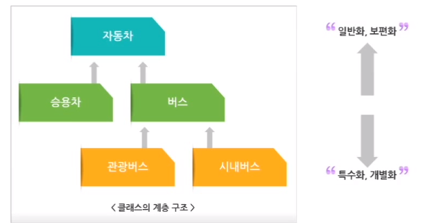

    ##### 부모 클래스와 자식 클래스

    ```java
    public class Car {
        // 멤버 변수 선언
        String name; // 공개할 변수
        int currentGear; // 공개할 변수
        
        // 메서드 선언
        void changeGear(int gear) {
            System.out.println("-> 기어를 " + gear + "단으로 변경한다.");
        }
    }
    ```

    -   부모 클래스로써 Taxi 클래스에 상속함

    ```java
    public class Taxi extends Car {
        // 요금
        int fare;
        // 승객 유무
        boolean passengerYn;
    }
    ```

    -   `extends` : 상속관계 예약어
    -   부모 클래스의 변수와 메서드를 모두 물려받음

    ##### 자식 클래스의 객체 생성

    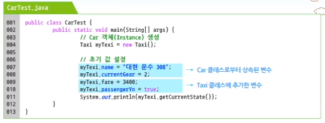

    ##### 상속의 논리적 관계

    -   클래스들 사이에 공통된 속성이나 기능들이 있을 경우, 상속을 통해 재사용성을 높일 수 있음

    -   부모 클래스와 자식 클래스의 관계가 일반화, 특별화 관계('is a ~')에 있어야 함 => 유지보수를 쉽게 함

-   상속의 종류 : 클래스의 상속은 하나의 하위 클래스가 하나의 상위 클래스를 갖도록 하는 단일 상속이 일반적이지만, 하나의 클래스가 두 개 이상의 상위 클래스를 갖도록 계층구조를 생성할 수 있다. 이를 **다중 상속(Multiple Ingeritance)**이라 하는데, 자바는 단일 상속만을 지원하는 언어이다.

    ##### 다형성(Polymorphism)

    -   one interface, multiple implementation - 하나의 인터페이스를 이용해 서로 다른 구현을 제공함

    -   다형성은 메서드 오버로딩(Overloading)과 메서드 오버라이딩(Overriding)을 통해 지원됨
    -   **메서드 오버로딩** : 한 클래스 안에 같은 이름의 메서드를 여러 개 정의하면서, 그 인자의 개수나 유형을 다르게 해 놓은 형태
    -   **메서드 오버라이딩** : 상속 관계에 있는 하위 클래스가 상위 클래스가 가지고 있는 메서드를 재정의하는 것
        -   재정의된 메서드가 선언된 형태는 상위 클래스에서 선언된 것과 같음

    ##### 추상화(Abstraction)

    -   구체적인 사실들을 일반화시켜 기술하는 것
    -   현실 세계에 존재하는 다양한 객체들의 공통된 특성을 모아 일반화해 놓는 것
        -   클래스를 정의하는데 중요한 역할을 함

    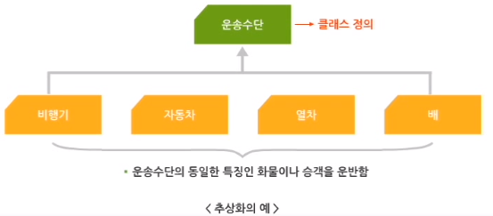

    ##### 캡슐화(Encapsulation)

    -   변수와 메서드를 하나의 추상화된 클래스로 묶는 과정을 의미함

    -   변수와 메서드를 하나로 묶어 독립적으로 동작하지 않도록 함
    -   캡슐 속 객체는 데이터와 메서드를 포함하고 있어서, 따로 분리할 수 없음

    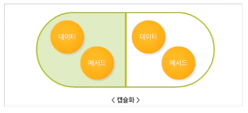

    -   객체가 제공하는 메서드를 통해 객체를 이용하고 데이터가 실제로 어떻게 처리되는지는 알 필요 없음

    ##### 정보 은닉(Information Hiding)

    -   객체지향 언어에서는 캡슐화된 변수나 메서드를 선택적으로 공개하거나 숨길 수 있음

    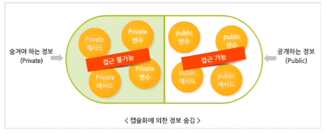

    ```java
    public class Car {
        // 멤버 변수 선언
        public String name; // 공개할 변수, public 예약어를 통한 정보 공개
        private int currentSpeed; // 은닉할 변수, Private 예약어를 통한 정보 은닉
        public int currentGear; // 공개할 변수
        
        // 메서드 선언
        // 공개할 메서드
        public void startEngine() {
            System.out.println("-> " + name + "의 시동을 켠다.");
            currentSpeed = 1;
        }
        
        // 공개할 메서드
        public void changeGear(int gear) {
            System.out.println("-> 기어를 " + gear + "단으로 변경한다.");
            currentGear = gear;
        }
        
        // 은닉할 메서드
        private int getCurrentSpeed() {
            currentSpeed = currentSpeed + (currentGear * 10);
            return currentSpeed;
        }
        
        // 공개할 메서드
        public void stopEngine() {
            System.out.println("-> " + name + "의 시동을 끈다.");
            currentSpeed = 0;
            currentGear = 0;
        }
        
        // 공개할 메서드
        public String getCurrentState() {
            return name + "의 현재 속도 : " + getCurrentSpeed();
        }
    }
    ```

    ##### 메시지(Message)

    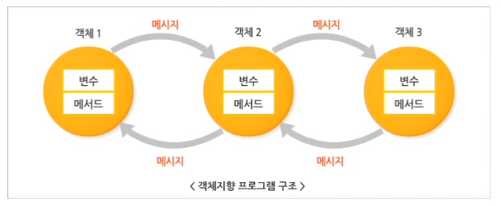

    -   객체 간에 서로 통신하는 방법
    -   객체 간에 메시지를 주고받기 때문에 여러 객체는 동일한 프로세스를 가질 필요 없음

    -   서로 메시지를 주고받는 데 객체가 존재하는 위치는 제약이 되지 않음

    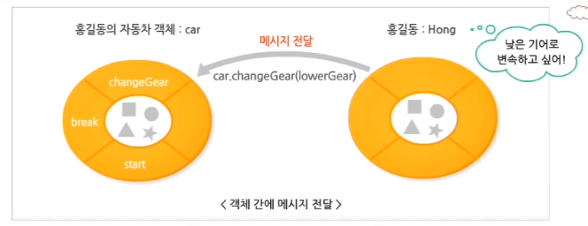

    -   메시지를 전달할 대상 객체인 `car`, 전달하고 싶은 메시지인 `changeGear()`, 메시지를 통해 전달하고 싶은 부과 정보가 있다면 해당 정보인 `lowerGear`

    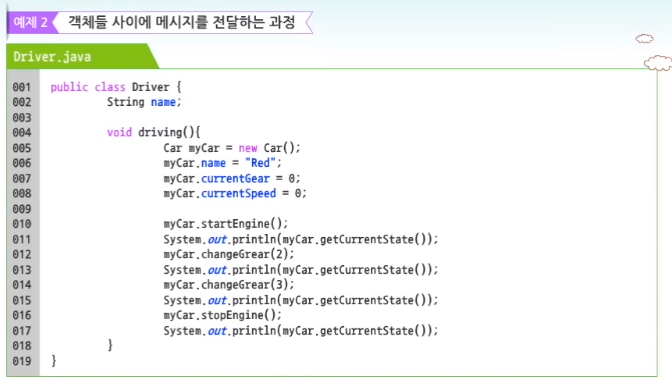

    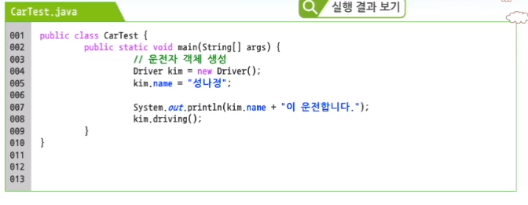

---

-   추상화는 현실 세계에 존재하는 다양한 객체들의 공통적인 특성을 모아 일반화해 놓은 것을 의미하며, 클래스를 정의하는데 중요한 역할을 한다.
-   다형성은 동일한 인터페이스를 이용하여 서로 다른 구현 객체를 일관된 방법으로 사용할 수 있도록 하며, 프로그램의 유지보수성을 향상시키는 중요한 개념이다.
-   상속은 기존에 잘 정의된 클래스로부터 변수와 메서드를 재사용하고 추가되는 기능만을 새롭게 정의하여 새로운 클래스를 정의할 수 있으며, 클래스들을 계층 구조화시킬 수 있다.
-   정보 은닉은 클래스에 포함된 변수나 메서드를 선택적으로 공개하거나 숨길 수 있다. 숨겨야 하는 정보(Private)와 공개하는 정보(Public)을 구분하여 기술할 수 있다.
-   캡슐화는 변수와 변수를 이용하여 로직을 처리하는 메서드를 하나의 클래스로 묶는 과정을 의미한다. 즉, 프로그래밍에서 변수와 변수를 처리하는 메서드를 하나로 묶어 변수와 메서드가 독립적으로 동작하지 않도록 한다.