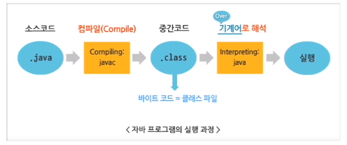
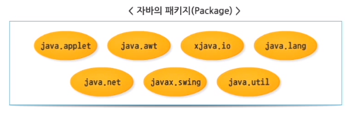
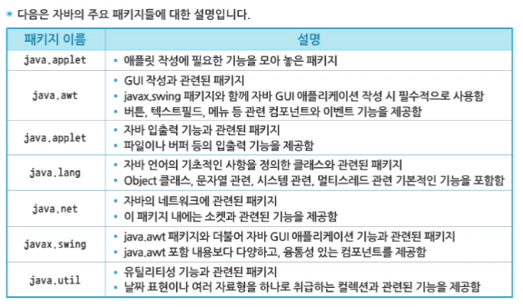
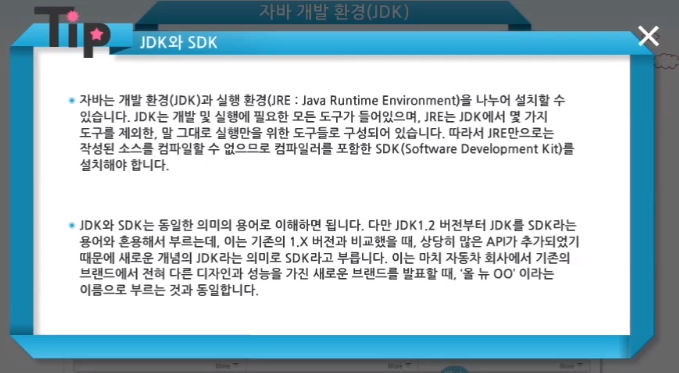
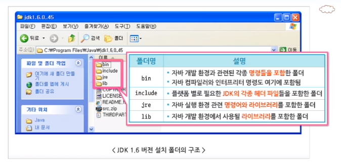

# 1차시. 자바 프로그램 개요 및 실습 환경 구축

### 1. 자바 언어 개요

##### 1) 자바 언어의 탄생 배경

-   1991년 : Green Project에서 가정용 전자기기에서 사용되는 작은 컴퓨터 언어를 디자인함
    -   가정용 전자기기에서 사용되는 언어는 작고 견고해야 하며, 신뢰할 수 있는 코드를 필요로 함
    -   다른 CPU가 선택될 수 있기 때문에 특정 디바이스에 종속되지 않아야 함
    -   Virtual Machine 에서 동작하는 중간코드를 생성하여 이식성이 높은 언어를 디자인함

-   1992년 
    -   C++(절차지향+객체지향 언어)에서 Oak(완벽한 객체지향 언어)를 새롭게 고안하여 Java로 명명함
-   1994년 : World Wide Web의 발전과 Mosaic(웹 브라우저)의 사용에 주목하여 자바를 기반으로 한 웹 브라우저 제작
    -   HotJava 브라우저로 발전함
    -   HotJava : Applet 이라 불리는 자바의 기능을 보여주기 위해 브라우저가 중간코드(Bytecode)를 해석할 수 있도록 만듦

-   1996년 : Netscape 2.0에서부터 자바가 지원됨
-   IBM, Symantec, Inprise, MS 등 많은 업체들이 자바를 지원하게 됨
-   자바 버전 1.2가 출시되면서, 자바 2 플랫폼으로 명명됨
-   현재 2014년 1.8버전까지 등장함

2) 자바 언어의 특징

-   자바는 단순(Simple)하다. : C언어와 C++언어의 복잡한 기능을 제외하여 코드를 단순하게 작성할 수 있음
    
-   가비지 컬렉터(Garbage Collector)에 의한 자동 메모리 관리로 할당된 메모리 해제를 신경쓰지 않아도 됨
    
-   자바는 객체지향(Object-Oriented)적이다. : 언어라는 객체를 사용해서 프로그램을 작성하도록 하는 언어를 "객체지향 언어"
    -   객체지향을 하게 되면 재사용성(Reusability)을 높일 수 있음
    -   단순히 코드의 재사용을 넘어선 객체의 재사용을 뜻함
    -   프로그램 개발에 필요한 수많은 클래스 라이브러리들을 API로 제공함

-   자바는 분산처리(Distributed)에 용이하다.
    -   분산 환경에서 CTP/IP 드으이 프로토콜을 통해 효율적으로 실행할 수 있도록 설계된 언어
    -   TCP/IP 네트워크 기능 내장, HTTP, FTP 등과 같은 프로토콜을 쉽게 사용할 수 있도록 라이브러리 제공
    -   서로 다른 컴퓨터 상의 객체들도 원격으로 호출하여 실행할 수 있는 원격 메서드 호출과 관련된 RMI(Remote Method Invocation) 기능의 라이브러리 제공

-   자바는 인터프리터(Interpreter)에 의해 실행된다. : 컴파일언어임과 동시에 인터프리터 언어인 자바!

    

-   자바는 견고(Robust)하다.
    -   다양한 플랫폼(컴퓨터) 상에서 실행되기 위해 에러의 원인이 되는 요소들을 제거하거나 자동으로 해결
    -   (1) 포인터를 사용하지 않음 (2) 자동으로 가비지 컬렉션 기능을 수행함 (3) 엄격한 데이터 타입의 검사를 통해 에러를 조기에 발견함 (4) 실행 시간에 발생하는 에러를 처리함

-   자바는 안전(Secure)하다.
    -   컴파일 시에 엄격하게 데이터 타입을 검사함으로써 프로그램 실행 시 발생할 수 있는 비정상적인 상황을 미리 방지
    -   클래스 로더(코드 분리), 바이트 코드 검증기(코드 검증)

-   자바는 플랫폼 독립적(Architecture Neutral)이다. : 사용하는 운영체제나 CPU 등의 하드웨어 사양에 관계 없이 실행될 수 있음(자바 가상 머신에 의해 각각의 운영체제에 맞는 기계어 코드로 변환됨)

-   자바는 높은 성능(High Performance)을 제공한다.
    -   가비지 컬렉션 기능이 추가되어 있어 자도응로 메모리 관리가 가능
    -   메모리가 할당된 객체의 상태를 추적 관리, 더 이상 참조되지 않으면 자도응로 할당된 메모리 해제 => 불필요한 메모리 낭비 방지

-   자바는 멀티스레드(Multithread)를 지원한다.
    -   Thread : 독자적으로 수행하는 하나의 작은 프로그램
    -   Multi-thread : 한 번에 여러 개의 스레드가 동시에 수행되는 과정, 하나의 CPU가 여러 개의 프로그램을 동시에 수행하도록 함 => 빠른 수행속도

-   자바는 동적(Dynamic)이다.
    -   자바 언어는 변화되는 환경에 잘 적응되도록 설계됨
    -   기존의 프로그램에 영향을 주지 않고, 라이브러리에 새로운 메서드나 속성들을 추가할 수 있음
    -   프로그램과 프로그램에서 사용되는 라이브러리와의 연결을 실행시간에 수행함 => 라이브러리의 변화를 곧바로 적용할 수 있음

3) 자바 플랫폼의 종류

-   플랫폼(platform)이란 프로그램이 실행될 수 있는 하드웨어 및 소프트웨어 환경을 의미

-   자바 플랫폼은 소프트웨어만으로 구성되며, JDK(Java Development Kit)로 설치됨

    (1) Java SE(Java 2 Platform Standard Edition) : 가장 기본이 되는 에디션으로써, 자바 언어 대부분의 패키지가 포함됨

    (2) Java EE(Java 2 Platform Enterprise Edition) : 현업에서 사용되는 API들이 집약된 에디션, 웹프로그래밍에서 가장 많이 사용되는 JSP, Servlet, 데이터베이스에 연동하는 JDBC, 그 외에도 JNDI, JTA, EJB 등의 많은 기술들이 포함됨

    (3) Java ME(Java 2 Platform Micro Edition) : 모바일 기기 등에서 사용되는 API가 포함된 에디션, 스마트폰의 자체적인 OS로 인해 자체 API의 사용으로 현재는 거의 시장됨

-   자바 플랫폼의 구조 : 자바 프로그램 => 자바 가상머신(자바 API) => 다양한 하드웨어 플랫폼

-   자바 가상 머신 : 자바 언어로 쓰여진 애플리케이션을 실행시키는 기능 수행

    -   자바로 쓰여진 애플리케이션과 특정 운영체제 중간에 존재하여 서로를 분리함으로써 애플리케이션이 운영체제에 영향을 받지 않고 동작할 수 있는 환경을 제공
    -   JVM은 운영체제와 직접적으로 통신을 해야 하기 때문에 운영체제에 맞는 JVM을 설치해 주어야 함

-   자바 API : 프로그래머가 필요로 하는 기본적인 클래스들을 거대한 라이브러리로 미리 만들어서 제공하는 것

    -   미리 제공되는 클래스를 표준 클래스라고 함
    -   자바 언어 자체는 작고 단순한 구조를 갖지만 많은 기능들을 API에서 제공하고 있음

    

    

2.  실습 환경 구축

1) JDK Document 사용

-   자바 API Document