# 2차시. 자바 프로그램 구조 및 데이터 타입

1.  자바 프로그램 기초

    1) 자바 프로그램 구조

    -   자바 프로그램은 하나의 '.java' 파일에 하나의 클래스를 정의
    -   클래스 내부에 실행에 필요한 변수나 메서드(또는 함수) 등을 정의

```java
public class 클래스명 {
    // 변수 정의
    
    // 메서드 정의
}
```

-   public : 자바 예약어로써, FirstClass.java 파일의 클래스(FirstClass)를 외부에 공개함
-   `{}` 클래스에서 제공할 명령 작성

-   자바 프로그램에서 '클래스'는 자바 프로그램의 최소 구성 단위로, 선언된 클래스 내부에 실행에 필욯나 변수나 메서드 등이 정의됩니다. 이때 자바 코드는 클래스 블록({}) 안에 작성되게 됩니다.

    ##### 자바 주석문

    -   프로그램 작성 일자나 버전, 작성자, 작성 목적, 그 밖의 프로그램 내의 부분적인 요소들에 대한 설명이 필요할 때 사용
    -   주석문은 컴파일 시 프로그램 코드로 인식되지 않음 => 컴파일 결과로 얻어낸 '.class' 파일의 크기에는 영향이 없음

    -   `/**  */` : javadoc 형태의 주석 처리에 사용
    -   `/*  */` : 다중행 주석 처리에 사용
    -   `// ` : 단일행 주석 처리에 사용

-   자바 Document 생성하기 : 자바 소스 파일을 작성한 후 JDK 에 포함된 javadoc이라는 명령을 사용하면 해당 자바 파일 내에서 javadoc(/** */) 주석문 내에 포함된 내용과 이 클래스 내의 여러 코드들(변수, 메서드, 생성자, 정보 등)에 대한 설명이 html 문서로 제공됩니다.

    2) 자바 애플리케이션 작성 및 실행

    ##### 자바 애플리케이션 구조

    -   자바 애플리케이션은 바이트 코드로 번역된 후에 바로 실행할 수 있는 일반 프로그램
    -   클래스 내에 'java'라는 명령어로 프로그램을 실행할 때 자동으로 호출되어 프로그램을 시작하는 main() 메서드를 가지고 있어야 함

```java
public class JavaApp {
    // 변수 선언
    
    // 메서드 선언
    
    public static void main(String args[]) {
        // 실행될 프로그램 코드
    }
}
```

-   `main()` : 프로그램을 시작하여 특정 작업을 수행함 

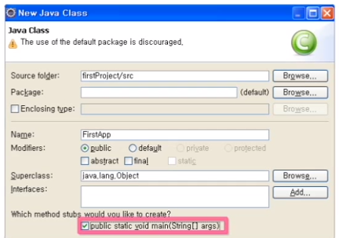

-   메인 메서드를 포함하도록 설정함

-   이클립스에서 `Ctrl` + `F11` 을 누르면 자바 프로그램이 실행됨

    3) 자바 애플리케이션 구문 분석

    ##### 자바 블록과 문장의 끝

    <블록({})>

    -   블록의 시작과 끝이 서로 짝을 이루지 않으면 컴파일 오류 발생
    -   클래스, 메서드, 자바 구문에 사용(if, for, try~catch 등)
    -   관련된 자바 문장들의 집합이고, 이를 하나의 단위로 묶기 위해 사용

    <세미콜론(;)>

    -   자바 문장이 여러 라인으로 이루어지거나, 한 라인으로 이루어질 때 각 문장을 구분하기 위해 사용

    ##### 자바 출력 문장

    -   `java.io` 패키지 : 처리하기 어려운 입출력 작업을 효율적으로 지원하기 위해 java.io 패키지를 제공하여 입출력 프로그램을 구현함

    

    4) 식별자와 예약어

    ##### 식별자

    -   클래스, 변수, 메서드에 주어지는 이름으로 각 요소의 식별을 가능하게 함

    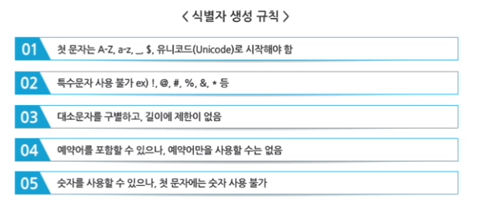

    -   관례상 클래스 이름은 대문자로, 메서드 이름은 소문자, 변수는 소문자, 상수는 대문자로 시작

    ##### 예약어

    -   시스템에서 일정 특성을 가진 언어로 등록된 것으로 데이터 타입이나 프로그램 정의를 위해 사용됨
    -   자바의 모든 예약어는 소문자로 이루어짐

    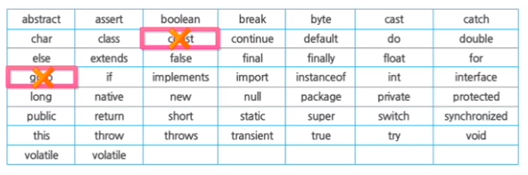

2.  자바의 데이터 타입과 변수

    1) 데이터 타입

    -   프로그램 언어에서는 사용할 데이터를 변수에 저장하고 관리
    -   정의된 변수를 통해 데이터의 의미를 정확하게 해석하여 사용
    -   java에서는 변수명 앞에 사용할 데이터 타입을 규정함

    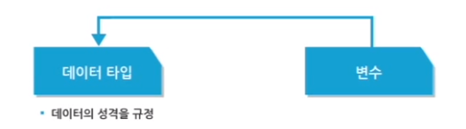

```java
int age;   // 기본형인 int 형의 age 변수 선언
age = 25;  // age 변수에 값 할당
```

-   bit : 데이터 표현의 가장 기본단위로, 0과 1을 의미
-   byte : bit가 8개 모이면 1byte가 되어 하나의 문자를 표현함, 2^8 숫자값(258), -127~128

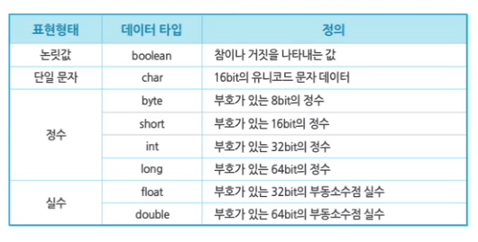

(1) 논리형(Logical)

-   boolean 형은 true와 false라는 두 리터럴(literal) 값이 있음
-   int 형과 boolean 형은 서로 형변환 불가능

```java
boolean useYn; // useYn 변수를 boolean 타입으로 선언
useYn = false; // 유효하다.
useYn = False; // 자바는 대소문자를 구분하므로 유효하지 않다.
useYn = "true"; // boolean 형에 문자열을 할당할 수 없으므로 유효하지 않다.
```

(2) 문자형(Text) : 표현범위는 '\u000' ~ '\uffff'

-   하나의 문자는 char 형으로 표현되고, char 형 리터럴은 홑따옴표(' ') 안에 넣어야 함
-   char 는 정수형으로 형변환이 가능하지만 -부터 값을 갖는 비부호형(Unsigned) 값임
-   자바의 문자형은 16비트 유니코드 문자로 표현됨

```java
char letter, tab, uniChar; // 변수선언
letter = 'a'; // ASCII 문자
tab = '\t'; // 탭과 같은 특수문자를 나타낸다.
uniChar = '\u????'; /* 특정 유니코드 문자, ????는 4개의 16진수 값으로 바꿔 사용한다. 유니코드를 사용할 경우 문자의 앞에 \u라고 명시하고 4개의 16진수 값을 표기하여 한 문자를 표현한다. */
```

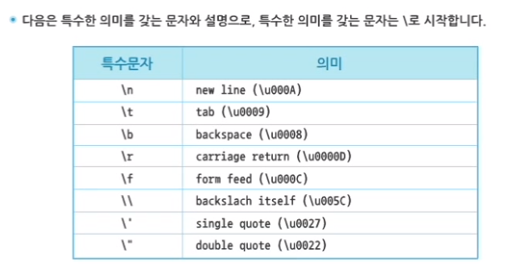

(3) 정수형(Integer)

-   정수형은 byte, short, int, long 으로 네 가지 형이 있으며, 부호형(Signed)임
-   0은 양수형, 1은 음수형을 의미
-   네 가지 기본형은 가질 수 있는 범위에 제한이 있으며, byte가 가장 작고 long이 가장 넓은 범위를 가짐
-   정수형 중 형을 명시하지 않은 경우 int형으로 기본 정의함
-   10진수(Decimal), 8진수(Octal), 16진수(Hexadecimal)로 표현

-   23(10진수 표기법), 023(8진수 표기법으로 0으로 시작), 0xBAAC(16진수 표기법으로 0x로 시작)
-   long 형을 사용할 경우 문자 L이나 l을 사용한다.

(4) 실수형(Floating Point)

-   실수형은 flat, double 두 가지 형이 있음
-   실수형 중 형을 명시하지 않으면 double이 기본형으로 정의됨
-   실수형 포맷은 표준인 IEEE 754를 채택하여 자바를 플랫폼 독립적인 언어로 만듬
-   실수형 리터럴은 소수점과 지수로 표현됨

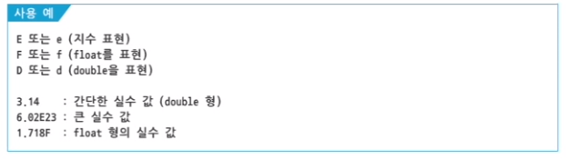

##### 데이터 타입의 범위 초과 시 발생하는 오류

-   변수 초기화 시 데이터 타입의 범위를 초과하는 값을 저장하면 컴파일 시에 오류 발생
-   +, - 등의 연산 결과로 값의 범위를 초과하는 경우에도 오류 발생

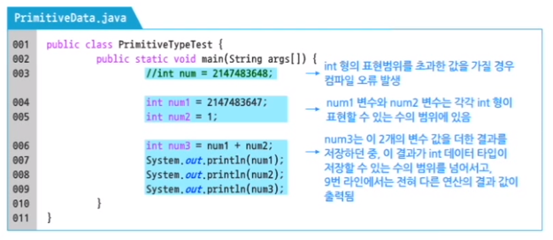

2) 변수의 선언과 초기화

##### 변수

-   프로그래머가 메모리상의 데이터에 접근하기 위한 방법 => 컴퓨터 내부의 데이터와 1:1 대응됨
-   실제 데이터를 의미하는 변수를 통해 메모리상의 데이터에 접근 가능함
-   한 가지 유형의 데이터만을 저장할 수 있고, 각 변수가 저장할 수 있는 데이터 유형이 정해져 있음
-   기본형(Primitive Type)과 참조형(Reference Type) 두 가지 변수가 존재함

##### 변수선언

-   자바 가상 머신(JVM)에게 데이터를 저장하기 위한 메모리 할당을 요청하는 것
-   데이터가 필요로 하는 크기의 메모리 할당을 위해 데이터 타입을 명시해야 함
-   `데이터 타입 변수명;` : 데이터 타입과 변수명 사이에는 하나 이상의 공백이 필요함

##### 변수 할당과 초기화

-   변수 할당 : 선언된 변수에 값을 대입하는 과정

    ```java
    int var; // 변수 선언
    ```

-   변수 초기화 : 변수에 처음 값이 할당되는 과정

    ```java
    var = 25; // 변수 초기화
    ```
    
    ```java
    int age = 25; // 한줄에 선언 및 초기화
    ```
    
-   기본형의 경우 할당된 메모리에 직접 값이 들어감

-   자동 초기화 : 자바에서는 변수에 값을 할당하지 않은 경우 자동으로 초기화됨. 변수의 값이 자동으로 초기화되는 것을 Default 초기화라고 하며, 각 데이터 유형별로 할당되는 기본값(Default Value)이 존재함. 단, 메서드(함수) 안에서 선언된 변수인 지역변수는 자동으로 초기화되지 않음

    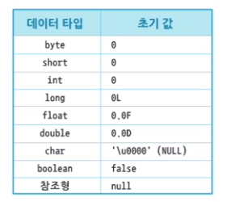

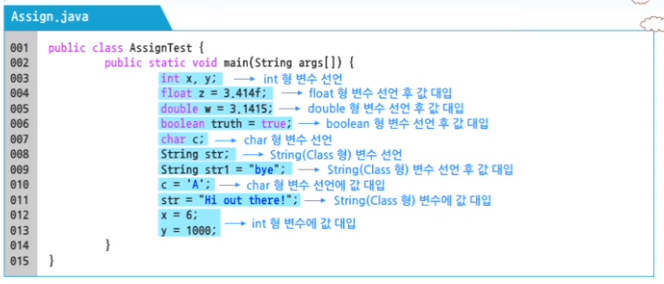

##### 지역(Local) 변수와 전역(Global) 변수

<전역(Global) 변수>

-   클래스 선언부 밑에 선언된 변수로, 여러 메서드에서 공통으로 사용 가능

<지역(Local) 변수>

-   메서드 선언부 밑에 선언된 변수
-   메서드 매개변수로 선언된 변수로, 해당 변수가 선언된 메서드 내에서만 사용 가능

```java
public class VariableDemo {
    int sum; // 전역(global) 변수
    public void addScore(int javaScore) { // 지역(local) 변수
        int score = javaScore; // 지역(local) 변수
        sum = sum + score;
    }
}
```

##### 변수의 범위

-   변수는 자신이 속한 블록({})을 벗어나면 사용 불가

3) 형변환

-   데이터 타입의 변환은 변수의 타입을 다른 타입으로 변경하고자 할 때 형변환 연산자를 사용하여 변환 함
-   Promotion, 묵시적 형변환: 작은 데이터 타입 => 큰 데이터 타입, 데이터 손실의 우려가 없어 자동 캐스팅
-   Demotion, 명시적 형변환 : 큰 데이터 타입 => 작은 데이터 타입, 데이터 손실의 우려로 명시적 캐스팅

##### 묵시적 형변환(Promotion)

-   형변환 연산자를 사용하지 않아도 자동으로 형변환이 이루어지는 경우(자동 형변환)

```java
int age = 25;
double avgAge = age; // double avgAge = (double)age;
```

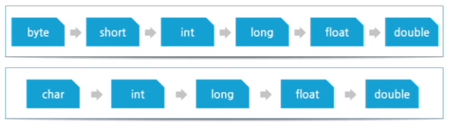

##### 명시적 형변환(Demotion)

-   더 작은 범위를 나타내는 데이터 타입으로 변환되는 경우(축소 형변환)

```java
double avgAge = 24.56;
int age = (int)avgAge;
```

