# 2차시. 클래스의 구조와 객체 생성

1.  클래스의 구조와 객체 생성

    1) 클래스의 구조

    ##### 클래스의 선언

    -   객체 지향 프로그램 : 모든 프로그램을 객체 단위로 구현
        -   현실 세계의 객체들을 추상화하여 만들어낸 소스 형태의 산출물인 클래스 작성을 시작으로 객체지향 프로그램은 시작

    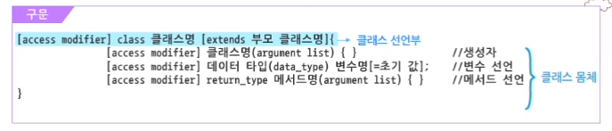

    -   클래스의 선언부와 몸체로 나뉘고 몸체에는 클래스의 멤버가 선언됨
    -   클래스의 멤버 구성
        -   객체의 초기화를 담당하는 생성자(Constructor)
        -   클래스가 가지는 속성을 정의하는 멤버 변수(Variable)
        -   클래스가 가지는 데이터를 조작하고 변환하는 메서드(Method)

    >   **클래스의 구성 요소**
    >
    >   -   접근 제한자(Access Modifier) : 접근 제한 시 사용되는 키워드로 생략이 가능함
    >   -   클래스(Class) : class 라는 예약어로 선언하며 클래스명은 식별자 이름 규칙에 따라 명시함
    >   -   생성자(Constructor) : 클래스명과 이름이 같은 메서드로 클래스로부터 객체를 생성할 때 사용함
    >   -   멤버 변수(Variable) : 클래스 속성을 정의하는 클래스의 멤버로서 변수명 앞에는 데이터 타입을 반드시 명시해야 함
    >       -   변수명은 식별자 이름 규칙에 따라 명시함
    >   -   메서드(Method) : 클래스가 가지는 데이터를 조작하고 변환하는 클래스의 멤버로서 메서드명 앞에는 반환되는 데이터 타입(Return_Type)을 반드시 명시하거나 *반환되는 데이터가 없는 경우 void로 선언함*
    >       -   메서드명은 식별자 이름 규칙에 따라 명시함

```java
public class Employee { // 클래스 선언부
    // 멤버 변수
    private String name; // 이름
    private int number; // 사번
    private String dept; // 근무 부서
    
    // 생성자
    public Employee(String name, int number, String dept) {
        this.name = name;
        this.number = number;
        this.dept = dept;
    }
    
    // 메서드
    public String getName() {
        return name;
    }
    public void setName(String name) {
        this.name = name;
    }
    public int getNumber() {
        return number;
    }
    public String getDept() {
        return dept;
    }
    public void setDept(String dept) {
        this.dept = dept;
    }
}
```

##### 클래스 Modifier


-   접근 권한과 관련된 Modifier 를 지정하지 않으면, 같은 패키지 내의 클래스에서만 접근 가능함
-   서로 다른 패키지의 클래스에 접근하기 위해서는 public 으로 지정해야 함

##### 클래스의 UML(Undefined Modeling Language) 표기법

-   소프트웨어 개념을 다이어그램으로 그리기 위해 사용하는 시각적 표기법
-   객체지향 프로그램을 시각화하고 시스템 사양이나 설계를 문서화
-   시스템을 구성하는 다양한 클래스들과 클래스들 사이의 관계를 그림으로 표현

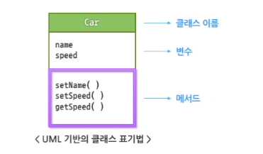

2) 객체 생성

-   자바의 변수 : 기본형 변수, 참조형 변수(배열 객체나 일반 클래스의 객체를 처리할 때 사용)

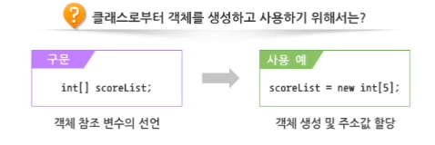

-   특정 클래스 유형의 객체 참조 변수 선언

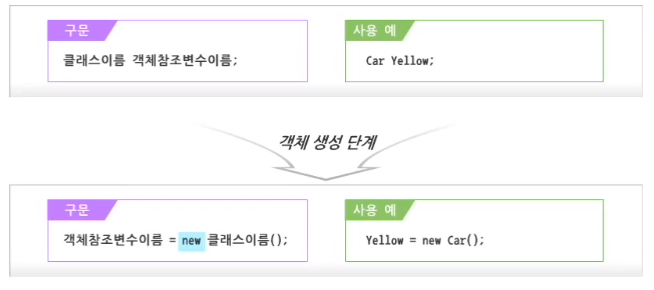

-   객체가 사용할 메모리 영역을 할당하는 과정으로 예약어 new 사용

-   생성된 객체에 대한 참조 값(일종의 메모리 주소)이 선언된 객체 참조 변수에 할당

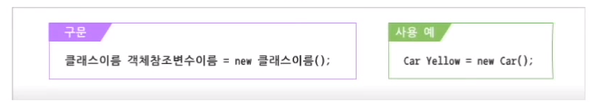

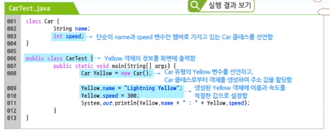

<Car 객체의 메모리 구조>

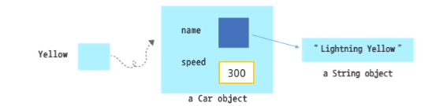

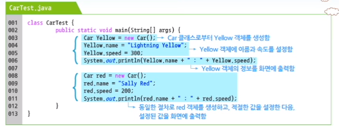

##### 멤버 변수의 선언

(1) 전역(Global) 변수

-   클래스 선언부 밑에 선언된 변수로 멤버 변수라고 칭함
-   여러 메서드에서 공통으로 사용할 수 있음 => 객체가 가질 수 있는 속성을 나타내는데 사용됨

(2) 지역(Local) 변수

-   메서드 선언부 밑에 선언된 변수
-   해당 변수가 선언된 메서드 내에서만 사용할 수 있음

```java
[modifier] 데이터타입 변수이름;
```

-   modifier
    -   변수에 대한 접근 권한이나 활용 방법 제어
    -   modifier 미지정 시 같은 패키지 내의 클래스에만 접근이 가능한 객체 변수라는 의미를 갖게 됨

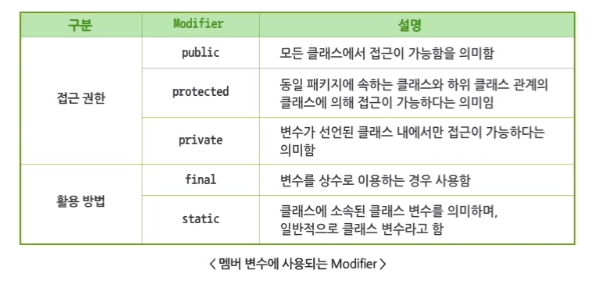

##### 접근 제한자(Access Modifier)

-   접근 제한자란 클래스, 변수, 메서드에 접근할 수 있는 권한을 나타내기 위해 사용됨

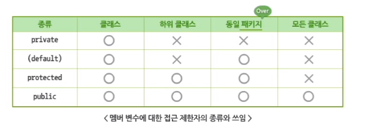

-   접근 관련 modifier를 통해 정보 은닉(Information Hiding)을 구현할 수 있음

-   패키지 : windows의 폴더와 유사한 개념으로 비슷한 기능의 클래스를 하나의 폴더에 저장/관리하기 위한 것

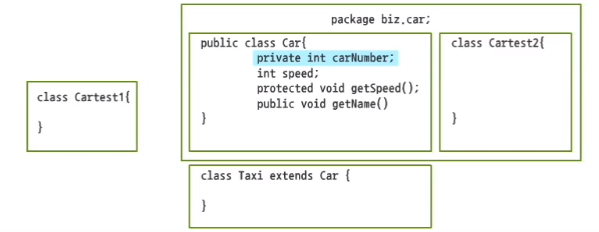


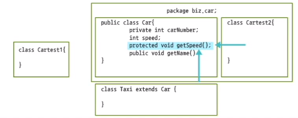

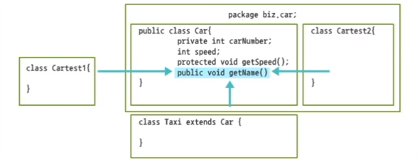

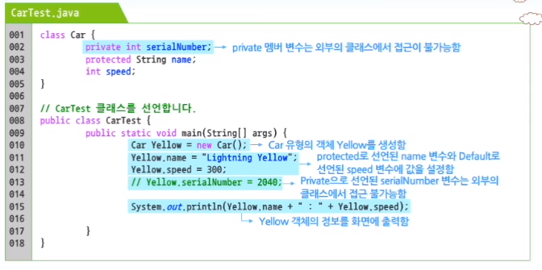

##### 정보 은닉(Information Hiding)

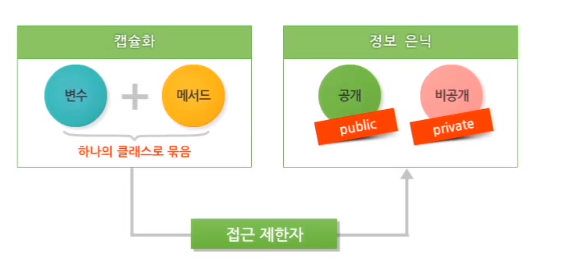

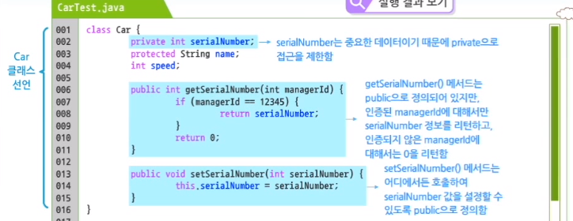


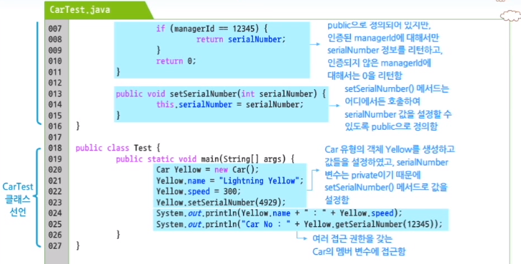

2.  멤버 메서드

    1) 멤버 변수

    ##### 메서드(Method) 정의하기

    -   메서드는 일종의 함수(Function)로서, 클래스가 제공할 로직들을 정의함

    ```java
    [access modifier] 반환형(return_type) 메서드명(arg1, arg2, ... argn) {
        // 메서드의 실행 코드
    }
    ```

    ```java
    public int sum(int num1, int num2) {
        int sum = 0;
        sum = num1 + num2;
        return sum;
    }
    ```

    -   메서드 앞에 접근 제한자를 붙일 수 있음
    -   메서드의 수행 결과를 리턴할 수 있도록 반환형으로 선언해야 함 => 반환 값이 없다면 void를 선언해야 함
    -   메서드명 뒤에 괄호를 이용해서 메서드 수행에 필요한 값들을 받아들일 수 있도록 매개변수를 선언함
    -   메서드의 실질적인 기능은 블록({}) 안에 구현하면 됨

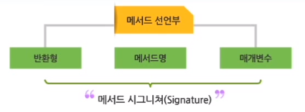

```java
// 메서드 선언
public int sum(int num1, int num2) { // '()'영역을 매개변수 영역이라고 하며, () 안에 선언된 변수들이 매개변수임
}

// 메서드 호출
sum(4, 7); // 메서드 '()' 안에 넘어가는 데이터를 Argument, 또는 인자라고 함
```

-   메서드 구성 요소

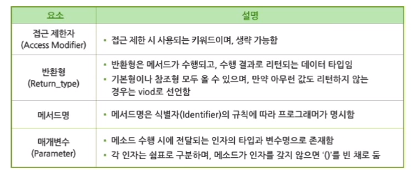

-   메서드 Modifier
    -   접근 권한을 나타내는 Modifier의 경우 그 쓰임은 멤버 변수와 동일함
    -   메서드를 선언하는 경우에도 접근 관련 Modifier를 이용해서 적절하게 정보 숨김을 구현할 수 있음

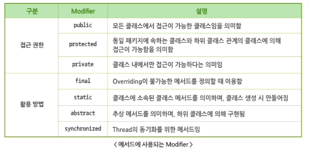

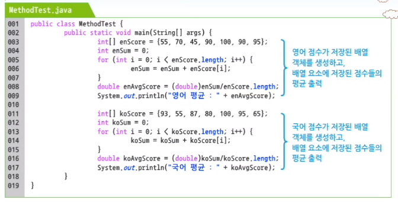

-   각각의 배열에 대해 공통된 메서드를 중복하여 구성해야 하는 번거로움 => 메서드를 통한 공통 로직의 재사용 프로그램

```java
public class MethodTest {
    public static void main(String[] args) {
        int[] enScore = {55, 70, 45, 90, 100, 90, 95}
        // 영어 점수의 평균을 getAvgScore() 메서드를 호출하여 출력하는 코드로 변경
        System.out.println("영어 평균 : " + getAvgScore(enScore));
        
        int[] koScore = {93, 55, 87, 80, 100, 95, 65}
        // 국어 점수의 평균을 getAvgScore() 메서드를 호출하여 출력하는 코드로 변경
        System.out.println("국어 평균 : " + getAvgScore(koScore));
    }
    
    // 매개변수로 들어온 정수 배열의 평균을 리턴하도록 구현
    private static double getAvgScore(int[] scoreList) {
        int sum = 0;
        double avgScore = 0.0;
        
        for (int i = 0; i < scoreList.length; i++) {
            sum = sum + scoreList[i];
        }
        avgScore = (double) sum / scoreList.length;
        return avgScore;
    }
}
```

-   메서드를 정의함으로써 코드가 간결해지고 재사용성이 높아짐

##### 유형별 메서드 : 리턴타입과 매개변수의 유무에 따라

(1) 리턴 값과 매개변수가 없는 메서드

-   메서드의 기능이 외부로부터 받아들일 데이터가 필요 없는 경우, 매개변수가 없는 메서드로 선언함
-   리턴할 데이터가 아무 것도 없는 경우, void 예약어로 리턴 타입을 지정하면 됨

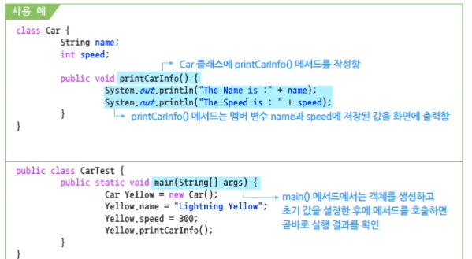

(2) 리턴 값은 없고 매개변수만 있는 메서드

-   매개변수 정보만 받아서 로직을 처리하고 아무 것도 리턴하지 않는 경우

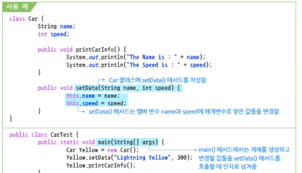

(3) 리턴 값고 있고 매개변수도 있는 메서드

-   매개변수로 받은 데이터를 이용하여 적절한 로직을 처리하고, 처리 결과를 메서드가 호출될 곳으로 되돌려주면 됨

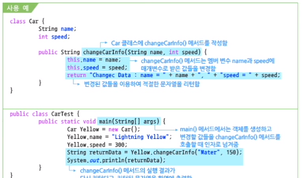

##### 리턴 값이 있는 메서드를 사용할 때 주의사항

-   리턴 값이 있는 메서드를 사용할 때, return 예약어 뒤에는 어떠한 구문도 작성할 수 없다.

    ```java
    public int divide(int num1, int num2) {
        return num1 / num2;
        System.out.println("실행되지 않는 코드");
    }
    ```

    -   return 예약어는 현재 실행 중인 메서드를 종료하고 해당 메서드를 호출한 위치로 제어를 이동시키는 기능의 예약어이다. return 예약어 밑에 작성된 출력문은 절대 실행될 수 없는 코드이므로 컴파일 되지 않는다.

    ```java
    public int divide(int num1, num2) {
        if(num1 == 0) {
            return 0;
        }
        System.out.println("실행되는 코드");
        return num1 / num2;
    }
    ```

    -   위 코드는 if 조건이 true 일 경우에만 return을 만나게 된다. 만약 if 조건이 false 라면, return을 만나지 않기 때문에 첫 번째 return 이후의 코드들이 컴파일 된다.
    -   특정 조건에 따라서 선택적으로 return 을 만나는 경우에는 return 이후에도 코드들을 작성할 수 있다.

##### 메서드의 자동 구현

-   멤버 변수들은 대부분의 경우 private 로 선언해서 외부에서는 숨겨진 형태로 만듦
-   public으로 지정한 메서드를 통해 접근하도록 클래스를 구현함 => **정보 은닉의 기본**
-   private 변수에 저장된 값을 리턴하는 getXXX() 메서드 => **Getter 메서드**
-   private 변수에 값을 저장하는 setXXX() 메서드 => **Setter 메서드**
-   이클립스에서는 private 변수에 대한 public Getter, Setter 메서드들을 자동으로 생성할 수 있는 기능을 제공함

##### 이클립스에서의 Getter/Setter 메서드 자동 구현

-   private 으로 접근 제한된 변수들을 가진 Employee 클래스를 정의함

```java
public class Employee {
    private String name; // 이름
    private int number; // 사번
    private int age; // 나이
    private String title; // 직함
    private String dept; // 근무 부서
    private String grade; // 인사고과 또는 등급
}
```

-   작성된 소스에서 `Alt` + `Shift` + `S` 키를 누름

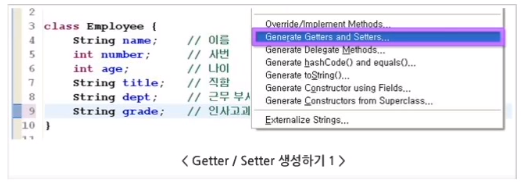

-   `Select All` 버튼을 클릭하면 모든 변수들이 선택되고, Getter/Setter 메서드가 자동으로 생성됨

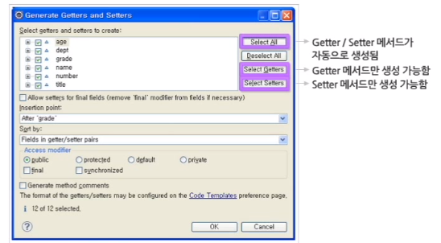

```java
public class Employee {
    private String name; // 이름
    private int number; // 사번
    private int age; // 나이
    private String title; // 직함
    private String dept; // 근무 부서
    private String grade; // 인사고과 또는 등급
    
    public String getName() {
        return name;
    }
    public void setName(String name) {
        this.name = name;
    }
    public int getNumber() {
        return number;
    }
    public void setNumber(int number) {
        this.number = number;
    }
    public int getAge() {
        return age;
    }
    public void setAge(int age) {
        this.age = age;
    }
    public String getTitle() {
        return title;
    }
    public void setTitle(String title) {
        this.title = title;
    }
    public String getDept() {
        return dept;
    }
    public void setDept(String dept) {
        this.dept = dept;
    }
    public String getGrade() {
        return grade;
    }
    public void setGrade(String grade) {
        this.grade = grade;
    }
}
```

-   private 접근 제한자로 변수들을 선언하여 외부의 접근을 차단함
-   private 변수에 값을 리턴하는 public Getter/Setter 메서드를 선언함

##### 이클립스에서의 toString() 메서드 자동 구현

-   작성된 소스에서 `Alt` + `Shift` + `S` 키를 누름


-   모든 변수들이 선택된 팝업 창에서 `OK` 버튼을 클릭하면 toString() 메서드가 자동으로 생성됨

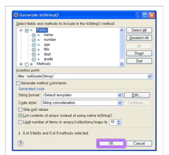

-   자동으로 생성된 toString() 메서드
    -   자동으로 생성된 toString() 메서드를 통해서 생성된 객체의 상태를 쉽게 확인 가능
    -   `System.out.println()` 메서드와 함께 사용될 때 참조변수만 지정하면 명시적으로 호출하지 않아도 자동으로 호출이 됨

```java
public class Employee {
    private String name; // 이름
    private int number; // 사번
    private int age; // 나이
    private String title; // 직함
    private String dept; // 근무 부서
    private String grade; // 인사고과 또는 등급
    
    // Getter/Setter Methods
    
    public String toString() {
        return "Employee [name=" + name + ", number=" + number + ", age=" + age + ", title=" + title + ", dept=" + dept + ", grade=" + grade + "]";
    }
}
```

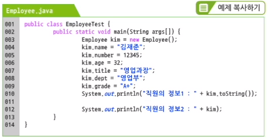

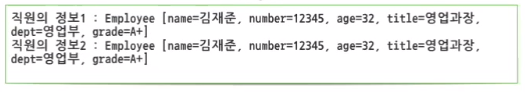

-   직원의 정보2 : 내부적으로 toString() 메서드가 호출됨