# 3차시. 자바 Modifier와 생성자

1.  자바의 Modifier

    1) static 예약어

    ##### 클래스 변수

    -   static 예약어 : 멤버 변수와 메서드 앞에 붙일 수 있는 modifier로써, 활용 방법을 제어함
    -   static 예약어가 붙지 않는 인스턴스 변수
        -   생성된 인스턴스마다 그 안에 클래스의 인스턴스 변수들이 포함됨
        -   일반적인 멤버 변수를 인스턴스 변수라고 부름
    -   static 예약어가 붙는 클래스 변수
        -   클래스로부터 생성된 인스턴스에 포함되지 않는 변수
        -   많은 인스턴스를 생성하더라도 메모리에 하나의 변수만 존재함
        -   객체를 생성하지 않고도 접근할 수 있는 변수
    -   클래스 변수가 필요한 이유 : 각 객체에 동일한 값을 가지는 인스턴스 변수가 ㅠㅗ함되면 메모리 관리에 악영향

    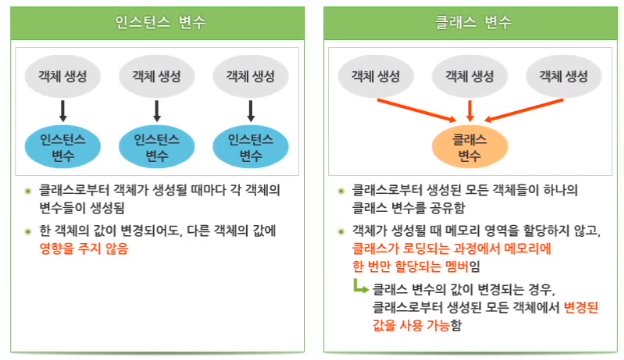

    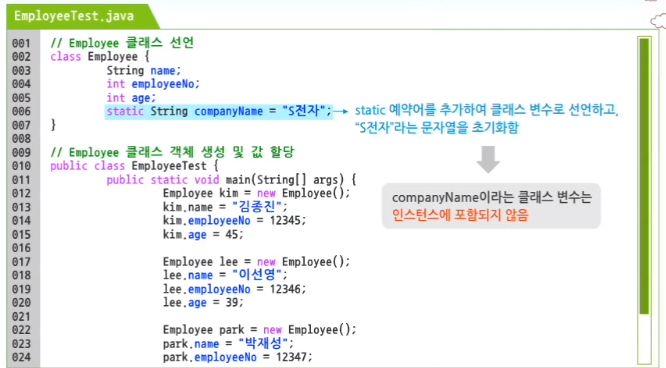

    ##### 클래스 변수의 값 변경

    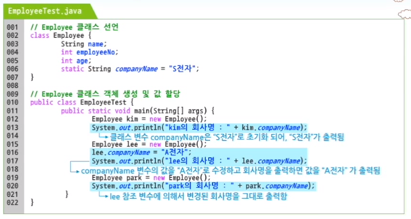

    ##### 클래스 변수의 접근

    -   클래스 변수는 일반적으로 객체 참조 변수 이름으로 접근하기보다는 클래스 이름을 통해서 접근함
    -   객체를 생성하지 않고도 클래스 변수에 접근 가능함

    ##### 클래스 메서드

    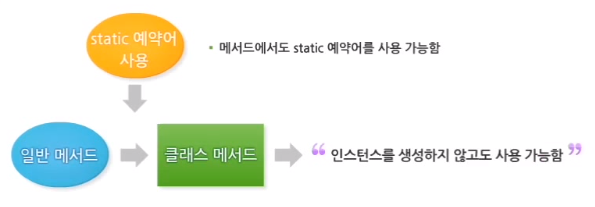

    -   인스턴스 변수는 인스턴스를 생성해야만 메모리에 잡히기 때문에 클래스 메서드에서 사용이 불가능함 => 클래스 메서드에서는 클래스 메서드만 호출이 가능함

    ##### 클래스 메서드에서 참조 가능한 변수와 메서드

    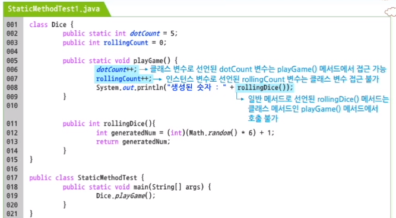

    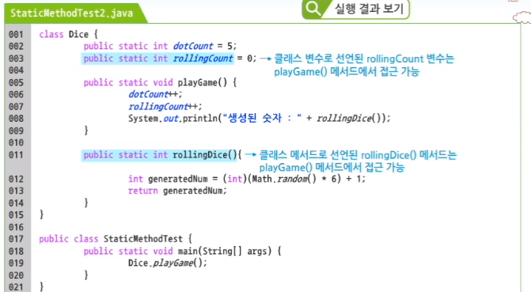

    ##### 변수와 final

    

    -   final이 붙은 변수는 단 한 번 초기화가 가능하지만, 초기화 이후에는 값을 변경할 수 없는 상수임

    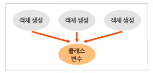

    -   클래스로부터 생성된 모든 객체들이 동일한 값을 가지는 경우 : 공통된 값을 가지는 변수를 클래스 변수로 선언하여 메모리를 효율적으로 사용함

    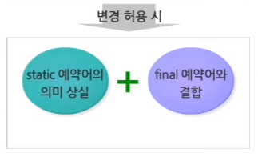

    -   클래스 변수의 값을 변경할 수 있도록 허용하는 경우 : static 예약어의 의미가 상실되므로, final 예약어를 결합하여 사용함으로써 초기화된 값을 변경할 수 없게 함

    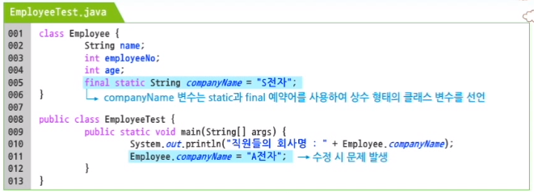

    -   Employee 클래스로부터 생성된 모든 인스턴스는 변경되지 않는 동일한 회사명을 갖음
    -   상수의 이름은 일반 인스턴스 변수와 구분하기 위해서 모두 대문자로 선언함
    -   여러 단어가 결합된 경우라면 단어와 단어 사이에 '_'를 이용하여 선언 : `companyName` => `COMPANY_NAME`

    ##### 메서드와 final

    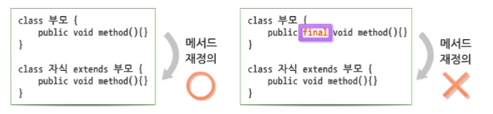

    -   **메서드 재정의(Overriding)**는 상속 구조에서 부모 클래스의 메서드와 동일한 모양의 메서드를 자식 클래스에서 상속 받지 않고 새롭게 정의하는 것음 말함
    -   final 예약어를 사용함으로써, 메서드 재정의(Overriding)를 금지함

    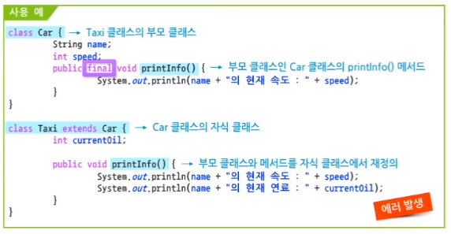

    ##### 클래스와 final

    -   클래스를 선언할 때 클래스 앞에 final 예약어를 추가하면 상속을 금지하는 의미임

    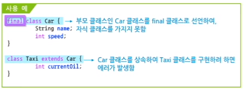

    2) abstract 예약어

    ##### 추상 메서드

    -   abstract 예약어는 클래스와 메서드를 선언할 때 사용하는 Modifier임
    -   클래스 선언부에서 abstract 사용 시 추상 클래스로 선언함
    -   메서드를 선언할 때 abstract 사용 시 추상 메서드를 정의함

    -   메서드의 시그니쳐(리턴 타입, 메서드명, 매개변수)만 정의되고 구체적인 행위, 즉 블록({}) 부분은 정의되지 않는 메서드를 의미함

    ```java
    returnType name([argType argName, ...]) {...} // 일반 메서드
    abstract returnType name([argType argName, ...]); // 추상 메서드
    ```

    -   추상 메서드를 선언할 때는 abstract 예약어는 메서드 앞에 붙여야 함
    -   메서드의 구체적인 행위를 표현하는 블록({}) 부분을 생략함
    -   메서드의 기본 형식인 리턴 타입, 메서드명, 매개변수가 선언되어 있어서, 메서드의 기본적인 기능은 유추 가능함

    ##### 추상 클래스

    -   추상 메서드를 포함하고 있는 클래스는 추상 클래스로 선언되어야 함
    -   추상 클래스가 추상 메서드를 포함하지 않을 수도 있음

    ```java
    // 추상 메서드를 포함한 추상 클래스
    abstract class AbstractClass {
        public abstract void methodA() {...}
        public abstract void methodB() {...}
    }
    ```

    ```java
    // 추상 메서드를 포함하지 않은 추상 클래스
    abstract class AbstractClass {
        public void methodA() {...}
        public void methodB() {...}
    }
    ```

    -   자바가 추상 메서드와 추상 클래스를 지원하는 이유 : 추상 클래스와 상속이 결합되어야 정확하게 추상 클래스를 이해할 수 있음

    ##### 추상 클래스와 상속

    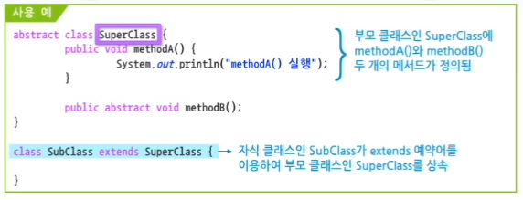

    -   SubClass가 컴파일 되지 않기 때문에 문제가 발생함

        -   부모 클래스로부터 methodA(), methodB()가 상속됨
        -   자식 클래스인 SubClass에는 구현되지 않은  methodB()가 추상 메서드로 있는 것과 동일함
        -   자식 클래스인 SubClass는 추상 클래스로 선언되어야 함

        -   SubClass 객체를 생성할 수 없는 클래스가 됨

2.  생성자

    1) 생성자 개요

    ##### 생성자의 개념

    -   생성자(Constructor)는 클래스로부터 객체를 생성할 때 호출되며, 객체의 멤버 변수를 초기화하는데 사용되는 메서드임
    -   객체를 생성할 때 객체에 필요한 값들을 초기화하는 개념은 배열과 동일함
    -   생성자 : 객체 생성 및 생성된 객체에 필요한 데이터를 초기화하는 과정을 단순화하여 코드의 양을 줄이는 역할 수행