# 3차시. 자바 연산자 및 배열

1.  자바 연산자

    1) 산술 연산자

    -   정수형, 실수형에 사용됨
    -   덧셈(+), 뺄셈(-), 곱셈(*), 나눗셈(/), 나머지 연산이 가능함

    

-   단항(피연산자가 한개인 연산자), 이항(피연산자가 두개인 연산자)

(1) 증감연산자(++, --)

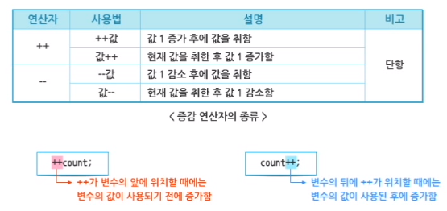

(2) 부호연산자(+, -)

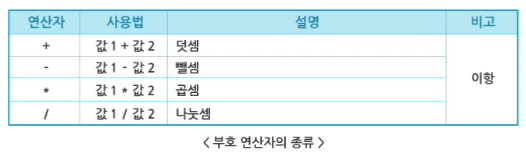

(3) 나머지연산자(%)

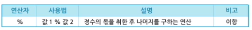

2) 비교 연산자

-   대소 비교나 객체의 타입 비교 등에 사용됨
-   비교 연산을 수행한 결과에 따라 true나 false의 boolean 데이터 타입(논리형)의 결과를 리턴함

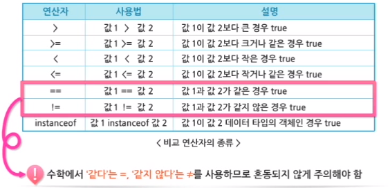

3) 논리 연산자

-   boolean 데이터 타입(논리형)에 적용되며, 결과 값으로 true 또는 false 값을 가짐
-   and(&), or(|), not(!) 연산자를 제공함

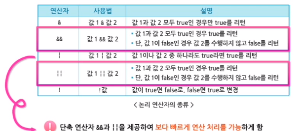

4) 비트 연산자

-   값을 비트(bit)로 연산하는 연산자
-   메모리를 최대한 효율적으로 활용해야 하는 경우 비트 단위로 데이터를 관리해야 함

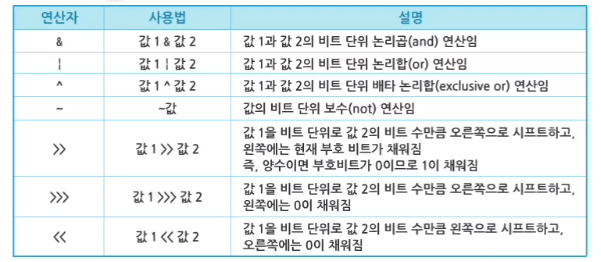

-   정수값을 이진수로 변환한 후에 각 비트가 모두 1이면 1을 리턴하는 것이 and, 각 비트 중 하나라도 1이 있으면 1을 리턴하는 것이 or, 각 비트가 서로 다른 이진수의 값을 가지면 1을 리턴하는 것이 exclusive or 연산임

5) 기타 연산자 및 연산자 우선순위

##### 대입 연산자(=)

-   변수에 값을 저장하기 위한 용도
-   대입 연산자(=)를 중심으로 오른쪽의 값을 왼쪽에 대입하여 사용함
-   간략한 표현을 위해 연산 후 대입 연산자를 지원함 => 가독성을 떨어뜨리기 때문에 가급적 사용하지 않음

```java
int sum += 58; // int sum = sum + 58;
```

##### 조건 삼항 연산자(?, :)

-   '?, :' 형태의 삼항 연산자를 제공하여 조건 삼항 연산을 제공함
-   조건 제어문인 if-else 문장을 축약하여 사용할 수 있음

```java
변수 = 조건 ? 값1 : 값2 // 조건이 참이면 값1이 변수에 대입되고 거짓이면 값2가 변수에 대입됨
```

```java
int score = 78;
boolean passYn;
passYn = (score > 80) ? true : false; // score인 78이 80보다 작으므로 passYn에 false 대입
```

##### 연산자의 우선순위

-   연산자의 우선순위는 고저임
-   최우선 연산자를 이용하여 먼저 처리될 연산자를 묶어서 처리하는 것이 가독성을 높일 수 있음

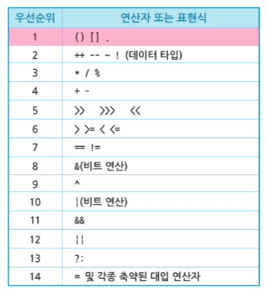

2.  자바의 배열

    1) 배열의 개념

    -   배열 : 같은 타입의 데이터들의 모임 => 메모리가 절약되고, 쉽고 간결하게 프로그램 작성 가능


##### 일차원 배열의 선언과 사용

-   일차원 배열 : `int[] javaScore;`
-   이차원 배열(다차원 배열) : `int[]\[] javaScore;`

(1) 배열 객체를 참조할 배열 변수 선언 

-   `데이터 타입` `배열 변수명` `[]`; 또는 `데이터 타입` `[]` `배열 변수명`;

```java
int scoreList[]; 또는 int[] scoreList;
String nameList[]; 또는 String[] nameList;
```

(2) 배열 객체 생성

-   배열 변수명 = new `데이터 타입` `[배열의 길이]`;

```java
scoreList = new int[100]; // 100개의 정수형 데이터를 저장할 수 있는 배열 객체 생성
nameList = new String[5]; // 5명의 이름 문자열을 저장할 수 있는 배열 객체 생성
```

(3) 배열 선언 및 생성을 한 문장으로 표현하는 경우

-   `데이터 타입 배열 변수명[] = new 데이터 타입[배열의 길이];` 또는 `데이터 타입[] 배열 변수명 = new 데이터 타입[배열의 길이];`

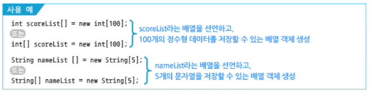

(4) 배열 선언 및 생성, 초기화를 한 문장으로 표현하는 경우

```java
int[] scoreList = {45, 80, 100, 59, 80}; // 초기 값을 나열해줌으로써 자동적으로 배열 객체 생성
scoreList = new int[] {45, 80, 100, 59, 80}; // 마지막으로 배열 객체를 명시적으로 생성하면서 초기 값 지정
```

-   배열이 생성되면 자바 예약어 `length`를 이용하여 배열의 길이를 알 수 있습니다. 우리가 배열의 길이를 알아야 하는 이유는 배열의 길이를 파악해야만 **배열에 저장된 데이터 수만큼 반복 처리**할 수 있기 때문이다. `배열 변수명.length;`

    ```java
    System.out.println(scoreList.length); // scoreList라는 배열의 길이 파악
    String flag = (scoreList.length != 50) ? "같지 않다" : "같다";
    // scoreList 배열의 길이가 50이 아니면 "같지 않다", 50이면 "같다"라는 값을 문자 타입의 flag 변수에 할당
    ```

-   배열에 저장된 값을 참조하고자 할 경우에는 해당 배열 변수 이름과 인덱스를 이용한다. 이때 인덱스의 번호는 0번부터 시작하고, 배열의 첫 번째 요소를 0번 인덱스 번호로 인식하므로, 인덱스 번호는 배열의 length 보다 작은 번호만이 유효하다. `배열 변수 이름[인덱스 번호]`

    ```java
    int[] scoreList = new int[100];
    scoreList[0] = 1; // 배열의 첫 번째 요소를 0번 인덱스 번호로 인식함
    scoreList[99] = 100; // 배열의 마지막 요소를 99번 인덱스 번호로 인식함
    System.out.println(socoreList[0]);
    System.out.println(scoreList[99]);
    
    scoreList[100] = 98; // 100번째 인덱스는 존재하지 않기 때문에 오류
    System.out.println(scoreList[100]); // 100번째 인덱스는 존재하지 않기 때문에 오류
    ```

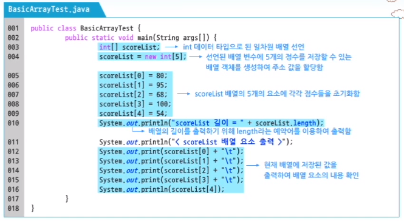

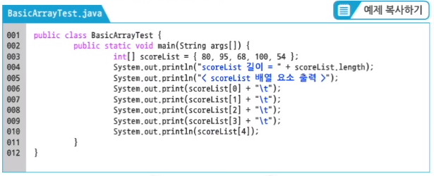

2) 다차원 배열

-   일차원 배열을 여러 개 사용하여 다시 배열을 구현한 것

-   다차원 배열 = 배열의 배열

    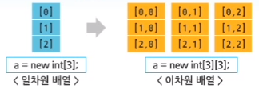

-   `데이터 타입` `배열 변수명` `[][]`; 또는 `데이터 타입` `[][]` `배열 변수명`; 또는 `데이터 타입` `[]` `배열 변수명` `[]`;

-   배열의 크기를 나타내는 배열 첨자([])만 차수에 따라 추가하면 됨

##### 이차원 배열의 선언과 사용

(1) 배열 객체를 참조할 배열 변수 선언

-   배열 변수명 = `new 데이터 타입` `[배열의 배열 길이]` `[배열 길이]`;
-   배열 변수명 = new 데이터 타입[배열의 배열 길이] []; 배열 변수명[인덱스 번호] = new 데이터 타입[배열 길이];
-   new 데이터 타입, 배열의 배열 길이, 배열 길이의 구문을 사용
-   첫 번째 배열 첨자의 길이만 지정하여 생성한 후에 일차원 배열들의 주소값을 순서대로 할당

(2) 배열 객체 생성

-   동일한 길이로 생성된 일차원 배열을 참조하는 형태

    ```java
    scoreList = new int[3][4]; // 배열 변수 scoreList에 3x4(가로 3, 세로 4)의 이차원 배열 생성
    // 또는
    scoreList = new int[3][];
    scoreList[0] = new int[4];
    scoreList[1] = new int[4];
    scoreList[2] = new int[4]; 
    ```

    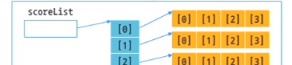

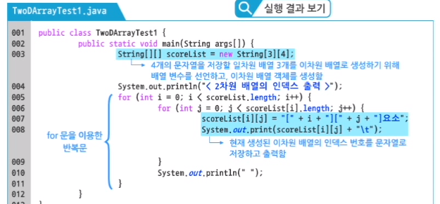

-   서로 다른 길이로 생성된 일차원 배열을 참조하는 형태

    ```java
    int[][] scoreList = new int[3][]; // 첫번째 배열 첨자의 길이를 지정하여 생성
    scoreList[0] = new int[2]; // 서로 다른 길이의 일차원 배열로 생성하는 구문 작성
    scoreList[1] = new int[3];
    scoreList[2] = new int[4];
    ```

    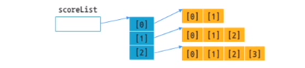

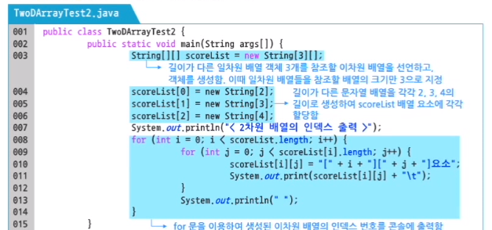

##### 명령행 매개변수

```java
// class 정의(선언)
public class commandLineArgTest {
    // main() 메서드를 정의하여 class를 실행함
    public static void main(String args[]) {
        // 실행될 코드
    }
}
```

-   main() 메서드 : 자바 애플리케이션에 필수적으로 있어야 하는 특수한 메서드, 자바 애플리케이션이 실행될 때 자동으로 실행됨

-   main() 메서드 내에서 다른 클래스 객체 생성 => 객체의 메서드 호출 또는 객체의 변수 조작 => 자바 애플리케이션의 원하는 결과 획득

-   `main(String args[])` : 문자열의 배열을 매개변수로 받아, 프로그램 실행 시 필요한 정보를 프로그램에 전달함 **"명령형 매개변수"**
    -   Main()의 매개변수는 String 데이터 타입의 배열임
    -   사용자가 명령행 매개변수로 입력한 문자열의 순서에 따라 차례대로 배열에 저장됨
    -   `java CommendLineArgTest arg1 arg2` : 공백을 구분자로 하여 여러 개의 값을 전달함
    -   명령행 매개변수에 해당하는 배열은 문자열 타입으로, 숫자 사용 시 문자열을 숫자로 변환해야 함
    -   자바 API에서의 메서드 제공 : Integer 클래스의 parseInt() 메서드 => 정수 형태로 변환, Double 클래스의 parseDouble() 메서드 => 실수 형태로 변환

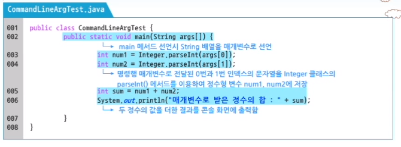

##### 명령행 매개변수가 필요한 프로그램 실행 방법

(1) 도스

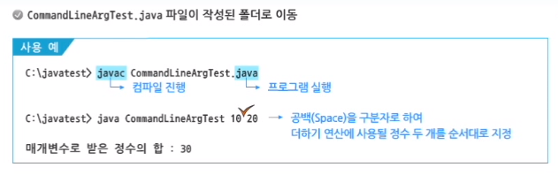

(2) 이클립스

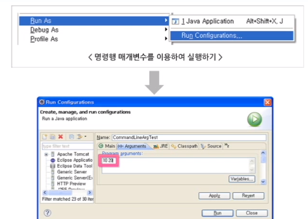

----

-   객체는 변수와 메서드로 구성되며, 이 객체를 추상화하여 소스 형태로 표현한 것이 클래스이다. 해당 클래스를 실행하기 위해서는 main() 메서드를 반드시 포함하고 있어야 한다.

-   배열은 동일한 타입의 데이터를 저장하고 관리하기 위한 저장공간이며 배열에 저장된 데이터들을 이용하여 다양한 결과 값들을 추출할 수 있다. 자바에서는 배열을 객체로 취급하여 new 연산자를 이용하여 생성할 수 있으며, 배열 객체 생성 시, 길이가 고정된다. 배열 객체의 저장공간을 접근할 때는 배열 index를 이용해서 접근하며, 배열의 길이는 length 변수를 이용하여 알아낼 수 있다.

```java
public class ArrayTest {
    public static void main(String[] args) {
        // 자바 점수 5개를 저장할 수 있는 정수형 배열 생성
        int[] javaScore = new int[5];
        // 1. 명령행 매개변수로 들어온 5개의 자바 점수를 배열에 저장
        javaScore[0] = Integer.parseInt(args[0]);
        javaScore[1] = Integer.parseInt(args[1]);
        javaScore[2] = Integer.parseInt(args[2]);
        javaScore[3] = Integer.parseInt(args[3]);
        javaScore[4] = Integer.parseInt(args[4]);
        
        // 2. 배열에 저장된 자바 점수의 총합 구하기
        int sumScore = 0;
        for (int i = 0; i < javaScore.length; i++) {
            sumScore += javaScore[i]
        }
        // 3. 자바 점수의 평균 구하기
        double avgScore = 0.0;
        avgScore = (double)sumScore / javaScore.length;
        
        // 4. 총합과 평균 출력
        System.out.println("자바 점수의 총합 : " + sumScore);
        System.out.println("자바 점수의 평균 : " + avgScore);
    }
}
```

-   이클립스에서 오른쪽 버튼 클릭 => run as => java application 으로 실행하면 매개변수를 넘겨주지 않아 콘솔에 에러가 찍힘
-   오른쪽 버튼 클릭 => run as => run configurations => 두 번째 탭 arguments에 매개 변수 입력(공백으로 구분자)