# 4차시. 자바 제어문

1.  자바 제어문

    1) 조건 제어문

    -   특정 조건을 만족할 경우 문장을 수행함
    >   `if` - `if-else` : 조건에 따른 단순 분기 처리
    >   `if-else if` - `switch` : 조건에 따른 다중 분기 처리
    
    -   조건 제어문은 조건식을 포함해야 함
    
    >   `if` - `if-else` - `if-else if` : true와 false를 리턴하는 조건식이 필요함
    >
    >   `switch` : case 에 해당하는 값이 필요함
    
    ##### if 문
    
    -   특정 조건에 따라 선택적으로 문장이 수행되는 분기문 처리 시에 사용함
    -   특정 조건에 부합되면 해당 문장을 실행하고, 부합되지 않으면 다음 수행 구문으로 넘어감
    
    ```java
    if (Expression) {
        statement1;
    }
    statement2;
    ```
    
    <if 문의 수행 흐름>
    
    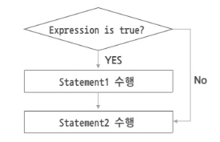

##### if-else 문

-   Expressions이 true인지 false인지에 따라 특정 statement만 수행되도록 처리할 때 사용함

```java
if (Expression) {
    statement1;  // Expression이 true일 때 수행
} else {
    statement2;  // Expression이 false일 때 수행
}
statement3;
```

<if-else 문의 수행 흐름>

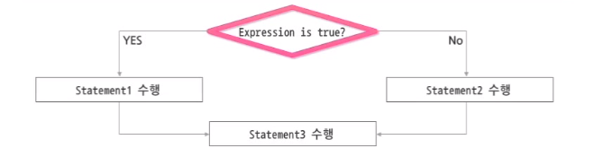

-   if문과 if-else 문은 수행될 statement가 한 줄일 경우, 해당 구문의 블록은 생략 가능하며, 아래 두 구문은 동일하게 수행된다.

    

-   if문에서는 내포된 구조가 가능하며, 이때 사용되는 else 절은 같은 블록 내에서 가장 가까운 if 문과 짝을 이룹니다.

    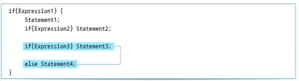

##### if-else if 문

-   여러 개의 조건에 따른 다중 선택이 필요할 때 사용

```java
if (Expression1) { // 여러 조건을 순차적으로 비교할 수 있음
    statement1;
} else if (Expression2) {
    statement2;
} else {
    statement4;
}
```

<if-else if 문의 수행 흐름>


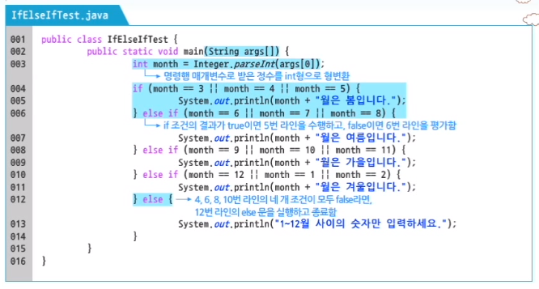

##### switch 문

-   if-else if 문을 이용하는 대신 다중 분기 처리를 할 수 있음
-   Expression에 대한 고정된 값들 중에서 하나를 수행할 수 있게 함

```java
switch (Expression) {  // Expression의 값에 해당하는 value의 case를 수행
    case value1:
        statement1;
        break;
    case value2:
        statement2;
        break;
    default:
        statement3;
        break;
}
statement4;
```

-   Expression의 결과는 char, byte, short, int형 만이 가능함

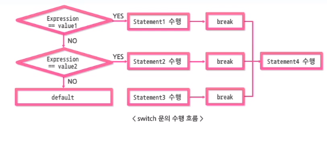

-   case 문 끝에 break 문이 없다면 break 문이 나타나거나, switch 블록이 끝날 때까지 다음 case 문에 대한 문장을 차례대로 수행해야 함

2) 반복 제어문

-   반복적으로 특정 문장을 수행함
-   `for` / `while` : 조건에 따라 특정 문장이 수행되지 않을 수 있음
-   `do-while` : 무조건 한 번 이상 수행됨

-   반복 제어문은 조건식을 포함해야 함
    -   for, while 문에 사용되는 조건식의 연산 결과는 true 또는 false를 사용함

##### for 문

```java
for(초기식; 조건식; 증감식) { // for 반복문에 대한 제어는 for 예약어 뒤에 있는 괄호에 작성되며, 세미콜론에 의해 초기식, 조건식, 증감식으로 구성됨
    statement1;
}
statement2;
```

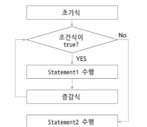

-   초기식 : 반복 횟수 제어, 한 번만 실행됨

-   조건식 : true이면 조건문이 반복 실행되고, false이면 조건문이 종료됨
-   증감식 : 무한 반복되지 않도록 함
-   for 블록 내 선언된 변수는 for 블록 내부에서만 사용함
-   for 블록을 포함하는 메서드 내에서 선언된 변수와 같은 이름으로 선언할 수 없음
    -   for 블록 내의 변수는 외부에서 호출이 불가능함

```java
public class ForTest {
    public static void main(String args[]) {
        for (int i = 0 i < 10; i++) {
            System.out.println("숫자 : " + i);
            int i = 20; // Error
        }
        System.out.println("최종 증가된 i 값 : " + i); // Error
    }
}
```

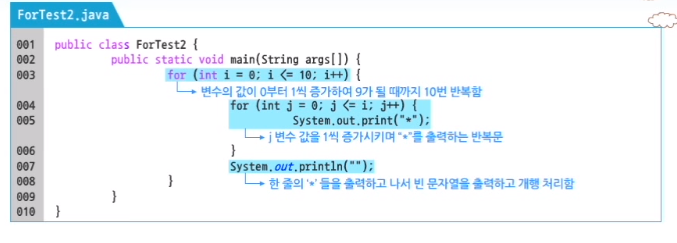

##### while 문

```java
while(조건식) {
    statement1; // while의 조건식이 true일 때 수행
}
statement2; // while의 조건식이 false일 때 수행
```

<while 문의 수행 흐름>


-   조건식이 true인 동안 i 변수를 1씩 증가시켜서 반복문을 종료할 수 있는 정상적인 while문을 작성해야 함

```java
int i = 0;
while (i < 10) {
    System.out.println("숫자 : " + i);
    i++; // 조건식이 true인 동안 i변수를 1씩 증가시켜서 i변수 값이 10이 되는 순간 조건식이 false가 됨
}
```

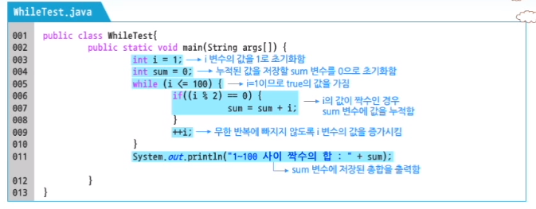

##### do-while 문

-   while 문과 비슷한, 반복문을 제어하는 식이 반복 블록 다음에 있음
-   반복 블록이 표현식 앞에 있으므로, 표현식이 false라도 반복문을 최소한 한번은 실행함

```java
do { // do 블록을 한 번 수행한 후에 while 조건식을 판단하는 구조
    statement1;
} while (조건식);
statement2;
```

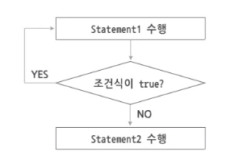

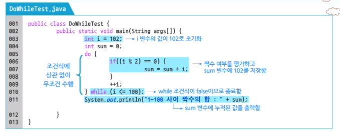

3) 이동 제어문

-   수행 흐름을 원하는 곳으로 이동시킬 때 사용
-   break
    -   switch 문에서 쓰일 경우, 수행을 중단하고 switch 블록을 종료할 때 사용
    -   반복 문에서 쓰일 경우, 수행을 중단하고 반복문 자체를 종료할 때 사용
-   continue
    -   반복문(for, while) 문에서 현재 단계의 수행을 생략하고 다음 단계로 계속 진행함
-   return
    -   메서드의 수행을 종료하고 메서드가 호출된 곳으로 제어를 이동시킴

##### break 문

-   break 문은 해당 반복문을 빠져 나오는데 사용함

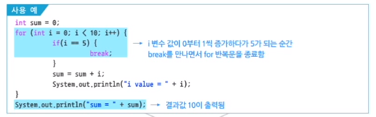

-   break 문은 자신이 속한 반복문 하나를 벗어날 때 사용함

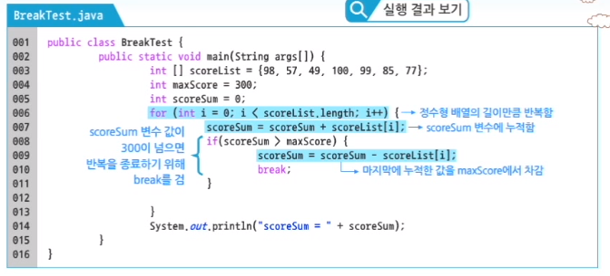

##### continue 문

-   반복문의 조건부로 실행 위치를 옮기므로, continue 뒤에 위치한 실행문은 실행되지 않음


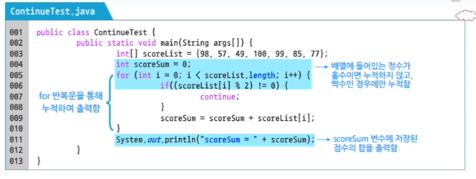

##### Label을 사용한 break와 continue

-   break와 continue 에서 Label을 사용하면 Label이 정의된 영역만큼 break와 continue가 적용됨

```java
// 특정 반복문에 Label 설정
Label : 반복문;

// 특정 Label로 break 설정
break [Label]; // label로 면시된 블록을 빠져나가는데 사용됨

// 특정 Label로 continue 설정
continue [Label]; // label이 있는 라인으로 점프함
```

-   Label로 인해 프로그램이 복잡해질 우려가 있으므로 사용을 권장하지 않음

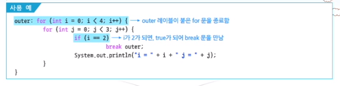

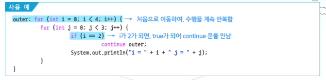

##### Return 문

-   현재 수행중인 메서드의 수행을 중단하고, 이 메서드를 호출한 곳으로 제어를 반환함
-   현재 수행중이던 메서드는 완료되지 못하고 중단됨

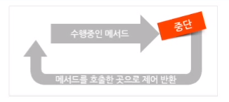

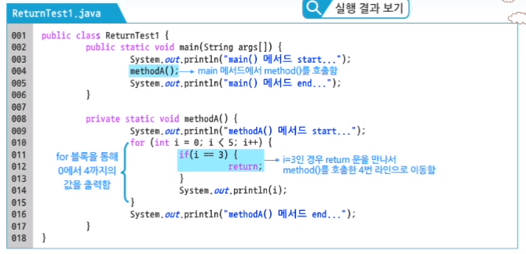

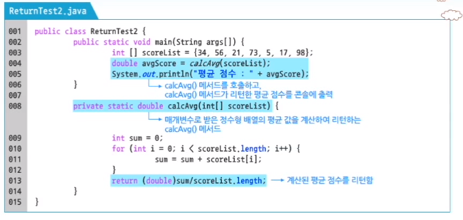

---

-   분기 처리를 위해 if 문이나 if-else 문을 사용하며, 특정 로직을 반복적으로 처리하기 위해서는 for 문이나 while 문을 사용합니다.