# 5차시. 자바의 상속

1.  상속(Inheritance)

    1) 상속의 개요

    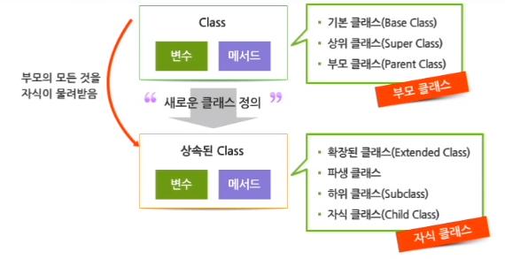

    ```java
    [modifiers] class 클래스명[extends 부모 클래스명] {
        // 클래스 멤버 부분
    }
    ```

    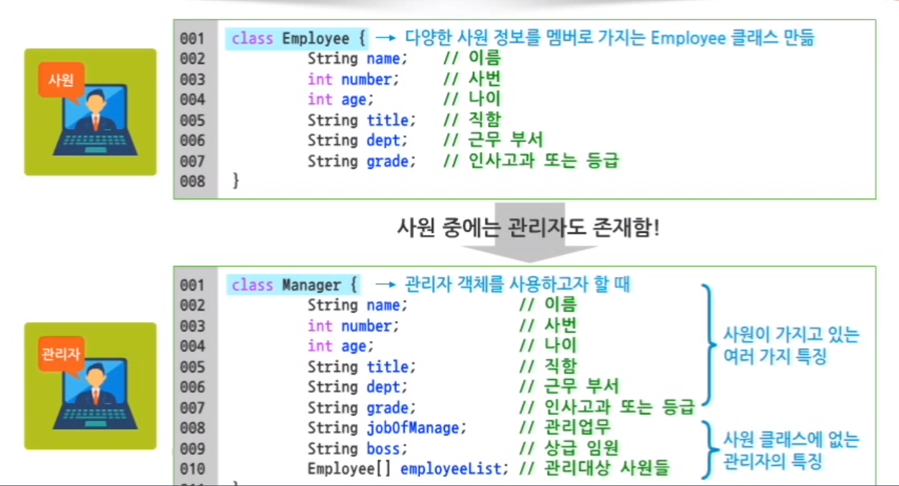

    ```java
    class Manager extends Employee {
        // Employee로부터 모든 변수들을 상속받았으므로, 중복되는 변수들을 선언하지 않고 간단하게 클래스를 구현함
        
        // 관리자의 특징만 쉽게 찾아낼 수 있음
        String jobOfManage // 관리업무
        String boss; // 상급 임원
        Employee[] employeeList; // 관리대상 사원들
    }
    ```

    -   상속을 통해 소스코드의 재사용성이 보장되며, 가독성이 높아짐

    ##### is a ~ 관계

    -   공통된 기능을 가지고 있다고 해서 모두 상속할 수 없음
    -   부모 클래스와 자식 클래스의 관계가 **일반화와 특별화의 관계**, 'is a ~' 관계에 있어야 함

    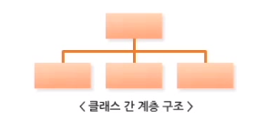

    -   논리적으로 'is a ~' 상속 관계가 성립되지 않을 경우 개발 및 유지보수가 어려움

    -   상속은 추가적인 것들을 확장한다는 의미가 중요함

    ##### 예약어 extends

    >   상속 = 부모로부터 물려받은 공통적인 특징 + 자식 클래스에서만 가지는 추가적인 특징

    ##### 단일상속(Single Inheritance)

    -   개발의 편의성과 가독성을 위해 문법적으로 단일상속만을 허용함
    -   단일상속이란 하나의 클래스는 오직 하나의 부모 클래스만 상속할 수 있다는 의미
    -   다중상속을 허용하면 중복되는 변수와 메서드가 상속되는 문제가 발생함

    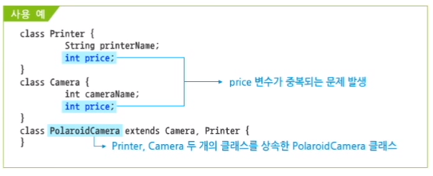

    2) 상속과 생성자

    ##### 생성자 자동 호출

    -   상속된 부모 클래스 객체가 생성될 때 부모 클래스의 생성자도 자동으로 호출되어 수행되면서 객체 초기화가 이루어지도록 함

    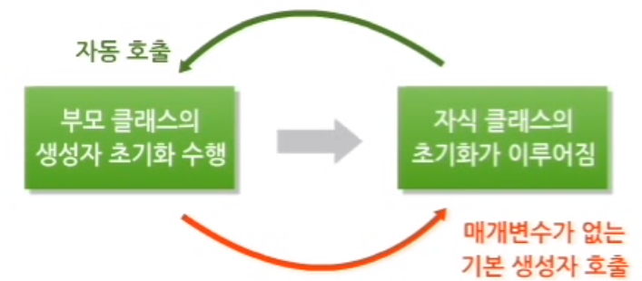

    -   부모 클래스의 생성자가 자동으로 호출되는 과정
        -   부모 클래스에 기본 생성자가 없다면 에러가 발생함

    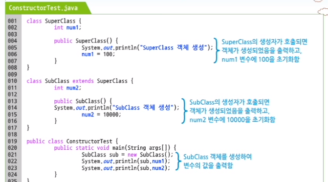

    -   부모 클래스의 생성자를 명시적으로 호출하는 프로그램

    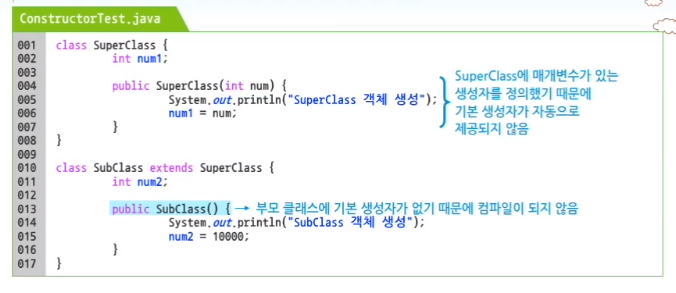

    ##### 부모 생성자 super()

    -   this() 생성자 호출 : 클래스 안에서 Overloading 된 또 다른 생성자를 호출하기 위해 사용
    -   super() 생성자 호출 : 부모 클래스의 생성자를 명시적으로 호출할 대 사용
        -   부모 클래스의 생성자가 Overloading 되어 여러 개 존재하는 경우 특정 생성자를 호출하기 위해 사용

    -   super() 생성자 사용하기

    ```java
    class Shape {
        int x = 0;
        int y = 0;
        Shape() {
            this(0, 0);
        }
        Shape(int x, int y) {
            // 부모 클래스인 Shape에서 x, y 좌표 값을 매개변수로 받은 값으로 초기화하는 생성자를 선언함
            this.x = x;
            this.y = y;
        }
    }
    
    class Circle extends Shape {
        int radius;
        // Circle 클래스의 생성자를 정의하고, 매개변수로 정수 3개를 받아서 x, y, radius 변수 값을 초기화함
        Circle(int x, int y, int radius) {
            // 부모 클래스인 Shape의 두 번째 생성자를 명시적으로 호출하여 x, y 좌표를 초기화함
            super(x, y);
            this.radius = radius;
        }
        public void draw() {
            System.out.println(x + ", " + y + " 좌표에 반지름이 " + radius + "인 원을 그린다.");
        }
    }
    
    class Test {
        public static void main(String args[]) {
            // Shape 자식인 Circle 클래스의 객체를 생성하고, draw() 메서드를 호출함
            Circle c = new Circle(200, 500, 100); 
        }
    }
    ```

    -   `// super(x, y);` 부모 클래스의 생성자를 명시적으로 호출하는 super(x, y)를 주석 처리하면 Shape 클래스의 기본 생성자가 호출되어 x, y 좌표는 0으로 초기화됨
    -   super() 생성자의 호출 위치 : 부모 클래스의 생성자를 호출하는 super()는 반드시 생성자의 첫 번째 라인에 위치해야 함
        -   부모 클래스의 생성자가 항상 자식 클래스의 생성자보다 먼저 수행되어야 함

2.  상속과 멤버

    1) 상속과 변수

    -   private 으로 정의된 변수는 상속 불가

    ```java
    class Employee {
        // Employee 클래스의 멤버 변수에 접근 관련 ,modifier를 지정함
        public String name;
        int employeeNo;
        // private으로 선언된 변수는 선언된 클래스 내부에서만 사용 가능함
        private int salary;
        int age;
        public String jobTitle;
        protected int deptNo;
        String grade;
    }
    
    class Manager extends Employee {
        // Employee 클래스를 상속한 Manager 클래스에 멤버 변수를 추가함
        // Employee 클래스의 모든 변수들은 Manager 클래스로 상속되지만, 급여에 해당하는 salary 변수는 상속에서 제외됨
        String jobOfManage;
        String boss;
    }
    
    public class ManagerTest {
        public static void main(String args[]) {
            // Manager 객체를 생성해서 Employee 클래스로부터 상속받은 멤버 변수에 초기 값을 설정함
            Manager Kim = new Manager();
            kim.name = "김재준";
            kim.employeeNo = 12345;
            kim.salary = 540; // Error
            kim.age = 46;
            kim.jobTitle = "인사 팀장";
        }
    }
    ```
    
    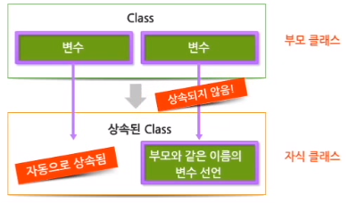
    
    -   부모 클래스의 멤버 변수는 자동으로 자식 클래스에 상속되어 들어감
    -   부모 클래스가 가진 변수와 같은 이름은 변수를 선언하면, 부모 클래스의 변수는 상속되지 않음 => 자식 클래스에서 정의한 변수가 사용됨
    
    ##### 부모 클래스와 같은 이름의 인스턴스 변수를 자식 클래스가 가지고 있는 경우
    
    ```java
    class Employee {
        String name;
        int employeeNo;
        int salary;
        int age;
        String jobTitle;
        int deptNo;
        String grade;
    }
    
    class Manager extends Employee {
        String jobOfManage;
        String boss;
        char grade; // Employee 클래스를 상속사하고 있으면서, Employee 클래스의 grade 와 같은 이름의 변수를 선언함
    }
    
    public class EmployeeTest {
        public static void main(String args[]) {
            Manager kim = new Manager();
            kim.name = "김재준";
            kim.employeeNo = 12345;
            kim.salary = 540;
            kim.age = 46;
            kim.jobTitle = "인사 팀장";
            kim.deptNo = 105;
            // kim.grade = "A등급" // grade 변수에 문자열을 할당하면 에러가 발생함
            kim.grade = "A" // grade 변수에 char 형의 값을 할당함
            kim.jobOfManage = "인사 관리";
            kim.boss = "성동일";
            System.out.println("인사고과 : " + kim.grade);
        }
    }
    ```
    
    ##### 부모 클래스와 같은 이름의 클래스 변수를 자식 클래스가 가지고 있는 경우
    
    ```java
    class Employee {
        String name;
        String grade;
        static String gender; // Employee 클래스에 gender 변수를 클래스 변수로 선언함
    }
    
    class Manager extends Employee {
        char grade;
        static char gender; // Employee 클래스에서 상속된 gender 대신 gender 변수를 char 형으로 다시 선언함
    }
    
    public class EmployeeTest {
        public static void main(String args[]) {
            Manager kim = new Manager();
            kim.name = "김재준";
            // kim.grade = "A등급";
            kim.grade = "A";
            // Manager.gender = "남성"; // grade 변수가 클래스 변수로 선언됐기 때문에 클래스 이름으로 접근해야 함
            Manager.gender = "M";
            System.out.println("인사고과 : " + kim.grade);
        }
    }
    ```
    
    ##### super 예약어
    
    -   this 예약어 : 생성된 객체 자신에 대한 참조를 의미함
        -   멤버 변수와 메서드 매개변수의 이름이 같을 경우, 두 변수를 구분하기 위해 사용함
    -   super 예약어 : 부모 객체에 접근할 수 있는 참조변수로 사용함
    
    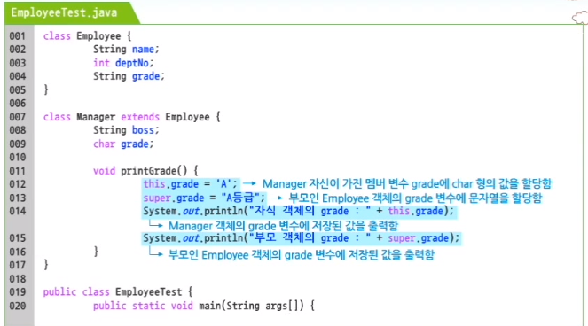
    
    ##### 메서드의 상속
    
    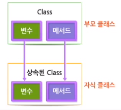
    
    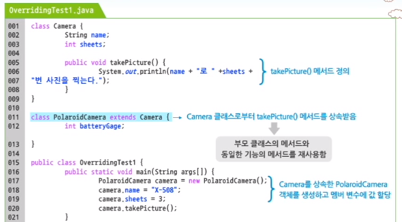
    
    ##### 메서드의 Overriding
    
    -   부모 클래스의 메서드를 재사용하지 않고 새롭게 정의하여 사용하는 것
    -   메서드 Overriding은 메서드 재정의라고 하며, 메서드 Overloading은 하나의 클래스에서 동일한 이름의 메서드 여러 개를 정의함
    
    -   상속 관계에 있는 클래스에서 자식 클래스가 부모 클래스의 메서드를 제정의해서 가지고 있는 개념
    -   자식 클래스에서 재정의된 메서드는 부모 클래스의 메서드와 메서드 이름, 매개변수의 유형과 개수가 동일해야 함
    
    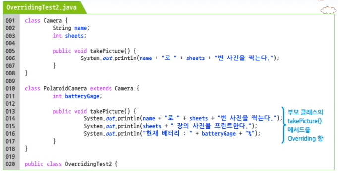
    
    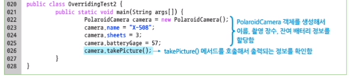
    
    ##### 메서드 Overriding 되지 않은 소스코드
    
    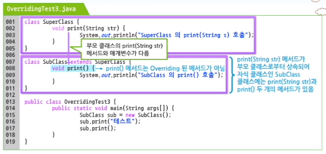
    
    -   SubClass 클래스에는 print(String str)과 print() 두 개의 메서드가 Overloading 되어 있음
    
    ##### 메서드 Overloading 과 Overriding
    
    -   메서드 Overloading : 하나의 클래스에 동일한 이름의 메서드가 여러 개 중복 정의되어 있는 것
        -   메서드 매개변수의 개수나 타입이 달라야 함
    -   메서드 Overriding : 상속 관계에 있는 두 개의 클래스에서 부모가 가진 메서드와 동일한 시그니쳐(리턴 타입, 메서드명, 매개변수)를 가진 메서드가 자식 클래스에 재정의되어 있는 것
    -   메서드를 Overriding 하면서 부모 클래스의 메서드를 사용하고 싶다면, 예약어 super를 사용하여 부모 클래스가 가진 메서드를 명시적으로 호출할 수 있음
    
    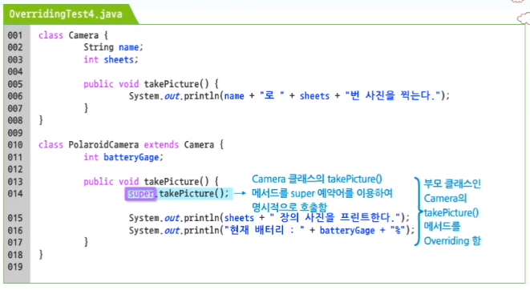
    
    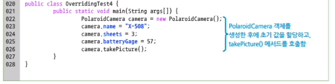
    
    ##### Overriding 과 final 예약어
    
    -   final 예약어는 변수, 메서드, 클래스 앞에 붙일 수 있는 Modifier
    -   `final` + `변수` : 상수를 의미
    -   `final` + `Class` : 자식 클래스를 가질 수 없는 클래스임을 의미
    -   `final` + `메서드` : Overriding을 금지하는 의미
    
    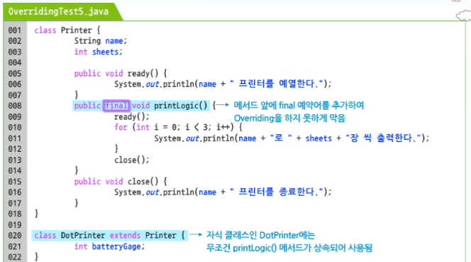
    
    

---

-   상속을 통해서 이미 존재하는 클래스를 이용하여 새로운 클래스를 만들 수도 있으며, 클래스들을 계층 구조화할 수 있다.
    -   상속을 통해 부모 클래스의 모든 변수를 재사용할 수 있다. 그러나 private 변수는 상속되지 않으며, 도일한 이름의 변수를 자식 클래스에서 재정의하는 경우에도 상속되지 않는다.
    -   부모 클래스의 메서드 역시 자식 클래스로 상속된다. 하지만 부모의 메서드를 자식 클래스에서 Overriding 하면 부모의 메서드는 상속되지 않는다.
    -   상속 관계에서 자식 클래스의 객체를 생성하면 부모 클래스의 생성자가 먼저 호출된다. 이때 부모 클래스의 기본 생성자가 있다면 기본 생성자는 자동으로 호출되지만, 기본 생성자가 없다면 super() 를 이용하여 명시적으로 호출해야 한다.
    -   부모 클래스의 메서드를 Overriding한 경우에 부모 클래스에 정의된 메서드를 자식 클래스에서 호출하기 위해서는 super 예약어를 사용해야 한다.