# 6차시. 추상 클래스와 객체의 형벼환

1.  추상 클래스와 내부 클래스

    1) abstract 예약어

    -   메서드와 클래스를 선언할 때 사용하는 Modifier
    -   메서드를 선언할 때 abstract 예약어를 붙이면 현재 메서들르 추상 메서드로 정의하겠다는 의미임
    -   추상 메서드란 메서드의 시그니처(리턴타입, 메서드명, 매개변수)만 정의
        -   구체적인 행위, 즉 블록({}) 부분은 정의되지 않은 특수한 메서드

    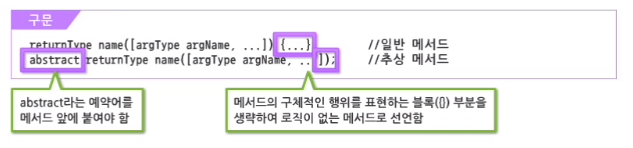

    -   메서드의 시그니쳐가 선언되어 있기 때문에 메서드의 기본적인 기능 유추 가능

    ##### 추상 메서드

    

    ##### 추상 클래스

    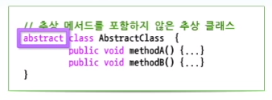

    -   클래스 선언부에 abstract를 사용하면, 해당 클래스를 추상 클래스로 선언한다는 의미가 됨
    -   추상 클래스는 일반적으로 하나 이상의 추상 메서드를 포함함
        -   추상 메서드가 없는 클래스도 추상 클래스로 선언 가능

    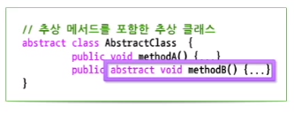

    -   추상 메서드를 포함하고 있는 클래스는 추상 클래스로 선언되어야 함

    -   추상 클래스는 객체 생성을 할 수 없음
        -   추상 메서드를 포함하고 있는 추상 클래스를 객체로 생성할 수 있도록 허용하면, 객체 참조 변수를 통해서 추상 메서드를 호출할 수 있게 됨
        -   아무런 기능도 제공하지 않는 추상 메서드가 호출된다는 것은 논리적으로 맞지 않음 => 문법적으로 객체 생성을 허용하지 않음

    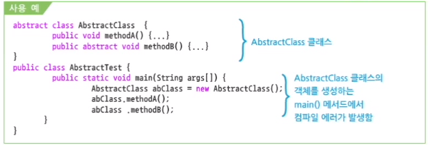

    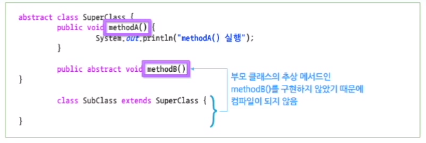

    -   부모 클래스인 SuperClass의 메서드 중 methodA()는 상속되므로 자식 클래스에 있는 것과 같음
    -   추상 메서드인 methodB()도 상속되므로 자식 클래스인 SubClass에 추상 메서드가 있는 것과 같기 때문에 컴파일 되지 않는다. => 자식 클래스인 SubClass는 methodB() 메서드를 Overriding 해야 함

    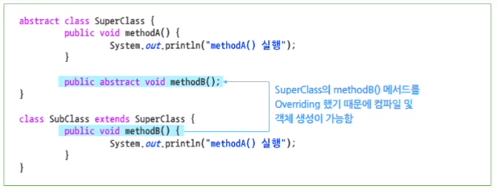

    ##### 추상 클래스의 활용

    -   추상 클래스로 객체를 생성하려면 자식 클래스를 작성하고, 추상 메서드들을 Overriding해야 함
    -   추상 클래스를 사용해야 유지보수의 편의성을 높일 수 있음

    ##### TV 클래스를 추상 클래스로 정의

    ```java
    // TV 클래스를 추상 클래스로 정의한다.
    abstract class TV {
        public abstract void powerOn();
        public abstract void powerOff();
        public abstract void volumeUp();
        public abstract void volumeDown();
    }
    
    // TV 클래스를 상속하여 S_TV 클래스를 정의한다.
    class S_TV extends TV {
        public void powerOn() {
            System.out.println("S_TV --- 전원을 켠다.");
        }
        public void powerOff() {
            System.out.println("S_TV --- 전원을 끈다.");
        }
        public void volumeUp() {
            System.out.println("S_TV --- 소리를 높인다.");
        }
        public void volumeDown() {
            System.out.println("S_TV --- 소리를 낮춘다.");
        }
    }
    
    // 추상 클래스 TV를 부모로 하는 S_TV 와 L_TV 클래스를 TV클래스에 정의된 추상 메서드를 적절히 Overriding하여 구현함
    class L_TV extends TV {
        public void powerOn() {
            System.out.println("L_TV --- 전원을 켠다.");
        }
        public void powerOff() {
            System.out.println("L_TV --- 전원을 끈다.");
        }
        public void volumeUp() {
            System.out.println("L_TV --- 소리를 높인다.");
        }
        public void volumnDown() {
            System.out.println("L_TV --- 소리를 낮춘다.");
        }
    }
    
    public class AbstractTVUser {
        public static void main(String[] args) {
            S_TV tv = new S_TV();
            tv.powerOn();
            tv.powerOff();
            tv.volumeUp();
            tv.volumeDown();
        }
    }
    ```

    -   추상 클래스를 이용하여 TV 클래스들을 구현하면 TV를 상속한 모든 TV 클래스들에 동일한 메서드들이 포함됨
    -   최소한의 수정으로 원하는 객체를 사용할 수 있게 되어 유지보수성이 좋아짐

    2) 내부 클래스

    ##### 내부 클래스의 특징

    -   클래스는 데이터를 표현하기 위한 하나의 기본 단위로, 멤버 변수와 메서드로 구성
    -   클래스가 다른 클래스를 포함하는 경우, 내부에 포함된 클래스를 내부 클래스라고 함
        -   파일 크기의 최소화, 보안, 성능 향상, 이벤트 처리 등을 쉽게 하기 위하여 사용됨

    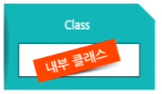

    -   내부 클래스는 정의되는 위치에 따라서 멤버 클래스와 지역 클래스로 나뉨

        -   멤버 클래스 : 멤버 변수와 동일한 위치에 선언된 내부 클래스

            -   static 예약어가 붙은 static 멤버와 instance 멤버로 나뉨
            -   동일한 클래스뿐만 아니라 다른 클래스에서도 활용될 수 있음
            -   클래스의 멤버 변수와 성격이 비슷함

        -   지역 클래스 : 메서드 내에 클래스가 정의되어 있는 경우

            -   지역 클래스(이름이 가지고 있음)와 무명 클래스(이름을 갖지 않음)로 나뉨

            -   활용 범위가 메서드 블록 내부로 제한되는 특징을 갖는 등 지역 변수와 성격이 비슷함

    -   자바의 클래스 구조를 더 조직화, 소스코드를 구현 시 효율을 높일 수 있음

    -   내부 클래스가 생성되기 위해서 외부 클래스의 객체가 반드시 필요함

    ##### instance 멤버 내부 클래스

    -   instance 멤버 내부 클래스는 클래스의 멤버와 동일한 위치에서 선언되는 내부 클래스
    -   멤버 변수나 메서드와 동일한 위치에서 선언되었기 때문에 다른 외부의 클래스에서도 사용 가능함

    

    -   컴파일을 통해
        -   Outside.class
        -   Outside$Inside.class => 외부 클래스명\$내부 클래스명.class 

    ##### static 멤버 내부 클래스

    -   내부 클래스를 저으이할 때도 static 예약어를 사용할 수 있음
    -   외부 클래스의 객체를 생성하지 않고도 내부 클래스 객체를 생성할 수 있음

    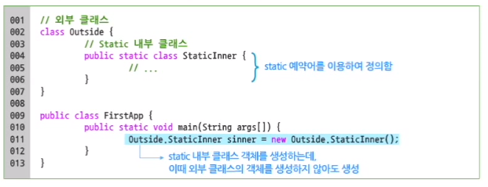

    ##### 이름이 있는 지역 내부 클래스

    -   메서드 내부에서 정의된 클래스로서 지역 변수와 동일한 범위를 가짐
    -   클래스의 이름이 명시되는 클래스임

    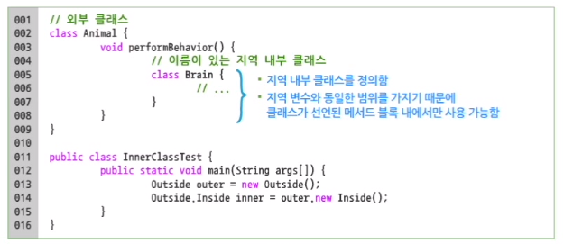

    -   컴파일을 통해
        -   Animal.class
        -   Animal\$1\$Brain.class => 외부 클래스명\$1$지역 내부클래스명.class

    ##### 이름이 없는 지역 내부 클래스

    -   이름을 갖지 않는 내부 클래스임

    -   new 예약어 뒤에 명시된 클래스가 기존의 클래스인 경우에는 자동적으로 이 클래스의 자식 클래스가 됨

    -   이름이 없기 때문에 무명의 내부 클래스라고도 함

    -   이름이 없는 지역 내부 클래스는 추상 클래스의 객체를 내부 클래스 형태로 생성할 때 자주 사용됨

    -   추상 클래스는 추상 메서드를 포함하고 있기 때문에 객체를 생성할 수 없음

        -   추상 클래스를 상속한 클래스가 만들어져 객체를 생성해야 함

        -   간단하게 이름이 없는 지역 내부 클래스로 만들어 사용하는 것이 편리할 수 있음

    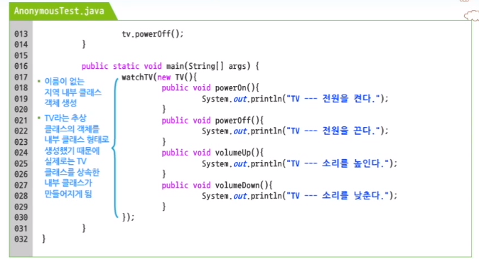

    ##### 이름이 있는 독립된 클래스로 구현

    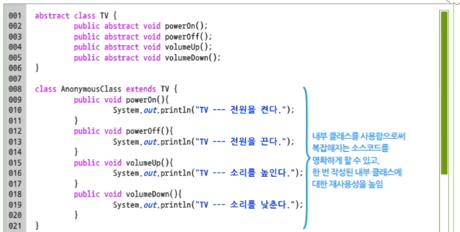

2.  객체의 형변환

    1) 형변환 개요

    ##### 형변환의 개념

    

    (1) 묵시적 형변환(Promotion)

    -   형변환 연산자를 사용하지 않아도 자동으로 이루어지는 경우(자동 형변환)

    (2) 명시적 형변환(Demotion)

    -   더 작은 범위를 나타내는 데이터 타입으로 변환되는 경우(축소 형변환)

    ```java
    double avgAge = 24.56;
    int age = (int)avgAge; // 문장에서 명시적 형변환이 발생
    ```

    ##### 객체 형변환의 개요

    -   객체 참조변수들 간의 대입 규칙
    
    
    
    >   -   왼쪽 항과 오른쪽 항의 객체 유형이 서로 다른 경우 두 유형이 서로 상속 관계에 있음
    >   -   왼쪽 객체가 오른쪽 객체의 상위 클래스인 경우에만 묵시적 형변환이 일어남
    >   -   자식 클래스에서 부모 클래스 유형으로 할당하는 것은 가능하지만, 반대의 경우 명시적 형변환을 해야 함
    
    -   내부 특정 클래스 형이 다른 클래스 형으로 변환될 수 있는지 여부를 수시로 판단해야 함
    
    -   `instanceof` 연산자를 사용함
    
        -   생성된 객체가 class와 관계있는 형(type)으로 만들어졌는지 확인
        -   true 또는 false 값을 반환
    
        ```java
        <생성된 객체 reference 변수> instanceof <class 또는 interface 명>
        ```
    
        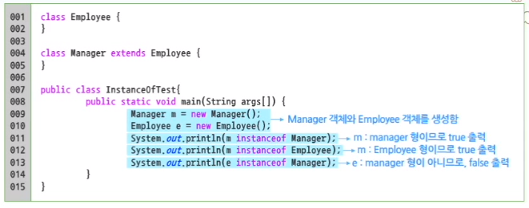
    
        -   Manager 객체 m은 Manager 객체의 형(type)인 동시에 Employee의 자식 클래스 => Employee 형임
    
        -   Employee 객체 e는 Manager의 부모 클래스로서, Manager 클래스가 가진 새로운 특징은 가지고 있지 않음 => Manager 형은 아님
    
    ##### 객체의 형변환
    
    -   클래스의 형변환은 기본적으로 상속 관계가 아닌 클래스 사이에는 발생하지 않음
    -   자식 클래스의 객체는 부모 타입의 참조 변수에 할당될 수 있음(묵시적 형변환)
    
    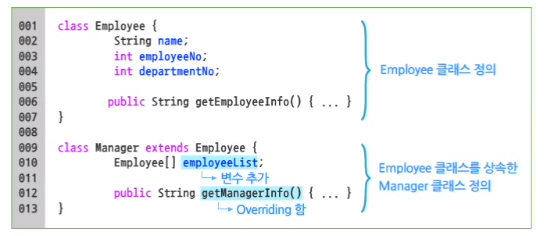
    
    (1) Employee 객체에 접근할 수 있는 경우
    
    ```java
    Employee e1 = new Employee(); // e1 참조 변수는 타입이 Employee이고, Employee 객체를 참조함
    ```
    
    
    
    -   타입과 생서오딘 객체가 모두 Employee임
    -   Employee 객체가 가지고 있는 변수나 메서드 모두 접근이 가능함
    
    (2) Employee, Manager 객체에 모두 접근할 수 있는 묵시적 형변환인 경우
    
    ```java
    Manager m1 = new Manager(); // m1 참조 변수는 타입이 Manager이고, Manager 객체를 참조함
    ```
    
    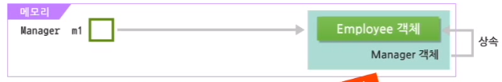
    
    -   타입과 생성된 객체가 모두 Manager임
        -   Manager 객체의 멤버 필드와 메서드 모두 접근이 가능함
    -   Manager 클래스는 Employee 클래스로부터 상속받았으므로, 객체 생성시 Manager 객체뿐만 아니라 Employee 객체도 생성
    -   Manager 객체 생성 시 Employee가 가진 속성이 메모리상에 로딩됨
    
    -   m1 참조변수를 통해 Employee, Manager 객체의 변수와 메서드를 모두 접근할 수 있음
    
    (3) 생성된 객체와 참조하는 변수의 타입이 다른 경우
    
    ```java
    Employee e2 = new Manager(); // e2 참조 변수는 타입이 Emplyee이고, Manager 객체를 참조함
    ```
    
    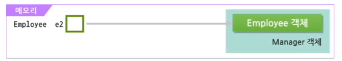
    
    -   Manager는 Employee를 상속했기 때문에 Employee 객체가 가진 변수와 메서드 모두를 가지고 있는 객체임
    -   생성된 객체는 Manager이지만 참조 변수의 타입이 Employee 이므로, 접근 가능한 변수와 메서드는 같이 Employee 객체로 제한됨
    
    (4) Employee, Manager 객체에 모두 접근할 수 있는 명시적 형변환인 경우
    
    ```java
    Manager m2 = (Manager)e2; // m2 참조 변수는 타입이 Manager이고, Manager 객체를 참조함
    ```
    
    
    
    -   Employee 형의 e2 참조 변수를 Manager 형으로 명시적 형변환을 하고 있음
    -   m2는 Manager 타입이므로 e2가 참조하고 있던 Manager 객체의 모든 멤버 필드와 메서드에 접근이 가능함
    
    ##### 객체의 형변환 적용
    
    -   객체의 형변환을 이용하면 프로그램을 좀 더 유지보수가 편한 구조로 변경할 수 있음
    
    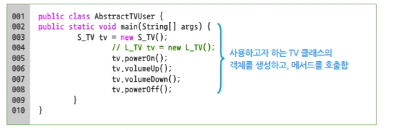
    
    -   객체의 형변환을 이용하면 소스 수정 없이 TV 객체를 바꿔서 실행할 수 있음
    
    (1) TV 객체를 생성하여 리턴하는 TVFactory 클래스 작성
    
    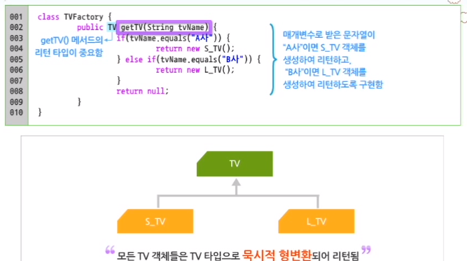
    
    (2) TVFactory 클래스를 이용하기 위한 AbstractTVUser 클래스 수정
    
    
    
    -   명령행 매개변수가 "A사"이면 S_TV 객체가 리턴되고, "B사"이면 L_TV 객체가 리턴됨
    -   모든 TV 클래스는 TV 클래스의 자식 클래스임 => TV 클래스들의 최상위 부모인 TV 타입의 변수로 받을 수 있음
    -   명령행 매개변수가 무엇인지에 따라 다른 TV 객체가 실행되고, 소스코드의 수정을 발생되지 않음
    
    2) 형변환과 멤버
    
    ##### 형변환과 멤버 변수
    
    -   형변환에 참여한 서로 상속 관계에 있는 두 클래스 간에는 동일한 이름의 변수가 존재하거나 메서드가 Overriding 되어 있을 수 있음
    -   생성된 객체 변수를 통해 멤버에 접근할 때 주의해야 함
    
    ##### 묵시적 형변환을 하는 경우
    
    -   변수에 대한 접근은 객체의 유형에 의해 결정됨
    -   메서드 호출은 할당되는 인스턴스에 의해 결정됨
    -   객체 참조 변수가 변수나 메서드를 참조하는 경우, 참조 관계를 결정하는 시간이 다르기 때문에 나타나는 차이임